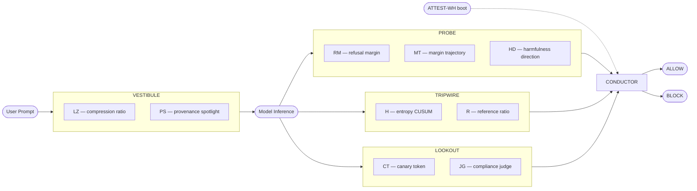

<div align="center">


[](https://git.io/typing-svg)

[](https://www.python.org/)
[](https://mypy-lang.org/)
[](https://docs.astral.sh/ruff/)
[](LICENSE)
[](https://arxiv.org/)
[](docs/engineering_reference.md)

**[What is it](#the-safety-cliff) · [Architecture](#system-overview) · [Setup](#quick-start) · [Math](#five-pre-registered-hypotheses) · [Engineering Ref](docs/engineering_reference.md)**

</div>

## The Safety Cliff

Post-training quantization (PTQ) degrades RLHF-installed safety behavior non-linearly in bit-width. A model that reliably refuses harmful requests at FP16 or NF4 may comply at Q3_K_M — not because the model's capabilities degrade proportionally (MMLU drops by ~8 points while toxicity safety drops ~50), but because the refusal direction in the residual stream narrows and the margin between harmful and harmless distributions collapses. This boundary, empirically near Q3_K_M for Llama-3 and Mistral families, is the **safety cliff**. Pre-hypothesis H1 asserts that both the geometric refusal-margin metric Δ_cliff and the behavioral attack-success-rate metric Δ_B-cliff exhibit a jump of κ ≥ 0.25 at the same quantization boundary, in at least two of three model families.

Defenses baked into model weights — RLHF fine-tuning, constitutional training, input-output classifiers that run inside the model — cannot survive quantization if the cliff hypothesis holds, because the quantized residual stream no longer encodes the safety signal the defense was trained on. The correct architectural response is to place defenses **in front of the model**, operating on input strings and summary statistics of model outputs, and to make the thresholds of those defenses **quantization-aware** via a per-scheme calibration map. Per the FPR-decoupling theorem (H2, H3), the false-positive rate of these gates is independent of quantization scheme up to calibration — the same gate system is portable across NF4, AWQ-INT4, Q4_K_M, and Q3_K_M without retraining. This is what CLIFFGUARD implements.

## System Overview



## Five Pre-Registered Hypotheses

| Hypothesis | Claim | Metric | Acceptance |
|---|---|---|---|
| **H1** Cliff existence | Δ_cliff and Δ_B-cliff jump ≥ κ at the same boundary in ≥ 2 of 3 families | detect_cliff_boundary() agrees across families | κ = 0.25 at Q3_K_M or below, ≥ 2/3 families |
| **H2** FPR decoupling (white-box) | PROBE-RM FPR varies < ε across {FP16, NF4, AWQ-INT4, Q4_K_M, Q3_K_M} after calibration | max(FPR) − min(FPR) across schemes | ε = 0.02 at fpr_target = 0.05 |
| **H3** FPR decoupling (black-box) | B-PROBE-LOGIT FPR varies < ε with strictly lower TPR than PROBE-RM | Same as H2 for B-PROBE-LOGIT; TPR comparison | ε = 0.02 AND TPR(B-PROBE) < TPR(PROBE-RM) |
| **H4** Composition gain | Full stack ABR < any single primitive at matched FPR | Wilcoxon signed-rank (full stack vs best single) | p < 0.01 (Bonferroni-corrected α) |
| **H5** Tier-C weakness | Tier C: no significant ABR reduction vs baseline; Tier C+: significant | Wilcoxon p for each vs no-defense baseline | p(Tier C) ≥ 0.05 AND p(Tier C+) < 0.05 |

## Four Hardware Tiers

| Tier | Hardware | Schemes | Active Gates | Scope |
|---|---|---|---|---|
| **A** | RTX 5060 8 GB | FP16, NF4, AWQ-INT4, GGUF Q4–Q6 | All 12 (including LOOKOUT-JG) | Full stack, LinUCB \|A\|=16 |
| **B** | Raspberry Pi 5 8 GB CPU | GGUF Q4_K_M, Q3_K_M | All except LOOKOUT-JG (11 gates) | LinUCB \|A\|=8; B-PROBE-CONSISTENCY substitutes for JG |
| **C** | 2 GB embedded (RK3588 / Jetson / Pi 4) | GGUF Q3_K_M, IQ3_XXS, Q2_K, RKNN W8A8 | VESTIBULE-LZ, VESTIBULE-PS, ATTEST-WH | Narrow scope; no bandit; **not defended against A7** |
| **C+** | 2 GB embedded + PromptGuard-2-22M-INT4 | GGUF Q3_K_M, IQ3_XXS, RKNN W8A8 | VESTIBULE-LZ, VESTIBULE-PS, B-PROBE-LOGIT, ATTEST-WH | Modest scope; static weights; H5 tests this tier |

## Quick Start

<details>
<summary><b>Tier A — GPU (RTX 5060)</b></summary>

```bash
git clone https://github.com/parnish007/CLIFFGUARD.git && cd CLIFFGUARD
uv sync --extra gpu
# Note: autoawq and vllm require Linux; both are skipped automatically on Windows/macOS.
uv run python scripts/dry_run.py --tier A --scheme FP16
```

Expected output: pipeline completes, all 12 gates produce verdicts, block decision printed.

</details>

<details>
<summary><b>Tier B — Raspberry Pi 5</b></summary>

```bash
git clone https://github.com/parnish007/CLIFFGUARD.git && cd CLIFFGUARD
uv sync --extra gpu
# llama-cpp-python builds on all platforms including ARM64.
uv run python scripts/dry_run.py --tier B --scheme GGUF_Q4_K_M
```

</details>

<details>
<summary><b>Tier C / C+ — Embedded</b></summary>

```bash
git clone https://github.com/parnish007/CLIFFGUARD.git && cd CLIFFGUARD
uv sync
# No --extra gpu needed for scaffolding or Tier C deployment.
uv run python scripts/dry_run.py --tier C --scheme GGUF_Q3_K_M
```

For Tier C+: `--tier C_PLUS`.

</details>

## Repository Layout

| Path | Purpose |
|---|---|
| `cliffguard/` | Main Python package — eight component sub-packages plus `eval/` |
| `tests/` | Full pytest suite (939 tests, Phase A scaffolding) |
| `scripts/` | CLI entry points: dry_run, run_full_evaluation, build_manifest, download_fold_a |
| `docs/` | Documentation: preregistration, architecture, math, setup, engineering reference |
| `data/` | Gitignored — populated by `scripts/download_fold_a.py` before Phase B |
| `artifacts/` | Gitignored — calibration tables, ARPA files, result JSONLs, figures, manifests |
| `configs/` | YAML configuration files for evaluation runs |
| `pyproject.toml` | Build, dependency, and tool configuration |
| `configs/example.yaml` | Canonical starting-point configuration (copy and edit) |

## Documentation

- [docs/what_is_it.md](docs/what_is_it.md) — Plain-language introduction and FAQ
- [docs/architecture.md](docs/architecture.md) — System architecture and component diagrams
- [docs/math.md](docs/math.md) — Mathematical foundations and formal definitions
- [docs/setup.md](docs/setup.md) — Device-by-device setup guide
- [docs/engineering_reference.md](docs/engineering_reference.md) — Module API reference for Phase B

## Evaluation

The test suite currently passes 939 tests with mypy strict on 53 source files and ruff clean on all Python. Phase A is scaffolding: all components are implemented as Phase A stubs that accept synthetic data, exercise the full pipeline shape, and verify API contracts without running any real model inference. Phase B wires real inference-engine adapters (transformers + bitsandbytes NF4, autoawq, vLLM, llama.cpp eval-callback) on the appropriate hardware tier and replaces synthetic arrays with real residual streams and logprobs. Full evaluation follows the pre-registered five-fold protocol documented in `docs/preregistration.md`: Fold A calibrates thresholds, Folds B/C measure cliff and defense composition, Fold D tests bandit drift recovery, and Fold E constructs the BCN-2 cross-family cliff dataset.

## Citation

```bibtex
@article{cliffguard2025,
  title   = {CLIFFGUARD: An Edge-Native, Quantization-Aware,
             Black-Box-Tolerant, RL-Adapted Defense System Against
             Prompt Injection at the Safety Cliff},
  author  = {[Author list — to be added at submission]},
  year    = {2025},
  note    = {Preprint}
}
```

<div align="center">


</div>
