# CLIFFGUARD — An Edge-Native, Quantization-Aware, Black-Box-Tolerant, RL-Adapted Defense System Against Prompt Injection at the Safety Cliff

**Tagline:** *Holding the line where quantization thins alignment.*
#filen name : cliffguard-unified-paper.md
---

## 1. Executive summary

**CLIFFGUARD is a stateless, online-RL-adapted, defense-in-depth system for prompt injection on edge-deployed LLMs operating across heterogeneous quantization regimes** — FP16, INT8, NF4, AWQ-INT4, GGUF Q5_K_M / Q4_K_M / Q3_K_M / Q2_K, RKNN W8A8 — with a black-box fallback path for closed-weight API endpoints. It is designed for the regime in which post-training quantization (PTQ) measurably degrades RLHF-installed safety behavior, while persistent storage of user payloads is forbidden by the deployment constraints of phones, kiosks, embedded gateways, and consumer GPUs. The system is built around a **safety-cliff hypothesis**: quantization-induced refusal degradation is non-linear in bit-width and the marginal degradation between 4-bit and 3-bit dominates the marginal capability loss; therefore *defenses must be built in front of the model, not inside it*, and must be quantization-aware in their *thresholds* rather than their *weights*.

CLIFFGUARD comprises eight named components — **VESTIBULE** (input-gate stack), **PROBE** (quantization-aware refusal-margin observer), **B-PROBE** (black-box fallback observer), **TRIPWIRE** (streaming change-point and entropy monitor), **CONDUCTOR** (contextual-bandit gate orchestrator), **LOOKOUT** (output-side judge and canary), **LADDER** (four-tier MVDS router), and **ATTEST** (weight-hash attestation) — composed by a contextual bandit that adapts gate weights online from sparse incident feedback. The architecture is justified by a **decoupling theorem**: write-side gates that operate on (a) input strings and (b) summary statistics of model outputs are independent of the protected model's quantization scheme up to a calibration map, so the same defense system can be ported across NF4 / INT8 / AWQ / Q4_K_M / Q3_K_M without retraining the gates themselves. Only the calibration map is quantization-specific. A black-box corollary extends the same FPR-portability guarantee to top-k log-probability observables.

**Why this matters now.** Egashira et al. (arXiv:2405.18137, NeurIPS 2024) and "Mind the Gap" (arXiv:2505.23786, OpenReview TV17MLZGuA, ICLR 2025) demonstrated that adversaries can force the malicious behavior of a model to be activated *only after* GGUF quantization, with attack-success-rate deltas of Δ = 88.7 % (insecure code), Δ = 85.0 % (content injection), and Δ = 30.1 % (refusal). Hong et al. (arXiv:2403.15447) showed that GPTQ-3-bit drops toxicity safety on Llama-2-13B-Chat by ~50 points while MMLU drops only ~8. Arditi et al. (arXiv:2406.11717) showed that refusal lives in a one-dimensional residual-stream subspace; Zhao et al. (arXiv:2507.11878, NeurIPS 2025) further showed that *harmfulness* and *refusal* are encoded in **separate** directions that can be isolated independently — the harmfulness direction at the user-instruction token, the refusal direction at the post-instruction token. None of the existing prompt-injection defenses (Llama Guard, PromptGuard 2, NeMo, Rebuff, SecAlign, Constitutional Classifiers, CC++, LlamaFirewall, CaMeL) was designed against this failure mode in this hardware envelope.

**What is novel.**
1. A **safety-cliff metric** $\Delta_\text{cliff}(b)$, in three independent variants — geometric ($\Delta_\text{cliff}$), Wasserstein ($\Delta_W$-cliff), and behavioral ($\Delta_B$-cliff) — that pre-register the refusal-margin geometry as the central observable while breaking the circularity of single-metric validation.
2. A **quantization-robust write-side observer** (PROBE) that uses *layer-wise margin signatures* extracted from the protected model's own logits and selected hidden states, not classifier weights, augmented by a harmfulness-direction probe (PROBE-HD) at the user-instruction token.
3. A **black-box observer** (B-PROBE) using top-k log-probabilities and N-paraphrase first-token divergence, allowing the same FPR-decoupling to extend to closed-weight endpoints with an honest, pre-registered TPR-gap.
4. A **streaming token-entropy CUSUM** (TRIPWIRE) that detects in-stream injection without buffering payloads, supplemented by a Neyman–Pearson-like reference-ratio against a fixed KenLM corpus.
5. A **contextual bandit** (LinUCB) that adapts gate weights online from incident telemetry only, never from raw payloads, with EXP3.S fallback under non-stationary attack distributions and a tightened safe-rollback rule for defender-aware adversaries.
6. A **decoupling theorem** giving formal portability of FPR across quantization schemes, with a black-box corollary and an explicit honest scope (TPR is *not* decoupled — that is the empirical question the cliff regime answers).
7. A **weight-hash attestation** primitive (ATTEST-WH) paired with the runtime gates to neutralize Egashira-style GGUF poisoning.
8. A **four-tier MVDS** mapped to RTX 5060 8 GB / Raspberry Pi 5 8 GB / 2 GB embedded / 2 GB embedded with a dedicated PromptGuard-2-22M classifier — with an *honest* statement of where each tier's defenses become structurally weak.
9. A **non-circular cliff dataset construction protocol** (Below-Cliff Naturals, BCN-2) with a five-fold pre-registered evaluation that separates calibration, cliff measurement, defense composition, bandit drift, and dataset construction onto independent corpora, and uses a *different* model family for paraphrase generation than for cliff testing.
10. A **per-engine integration matrix** that resolves whether multi-layer PROBE is feasible on each runtime — transformers + bitsandbytes / autoawq, vLLM, llama.cpp / GGUF, Apple MLX, Qualcomm QNN / AI Hub, Google AICore, RK3588 RKNN — with concrete API references and skeleton code for the hard cases.

We deliberately commit no fabricated empirical numbers. All numbers are pre-registered targets or are reproduced verbatim from cited papers. We hypothesize, we measure, we pre-register the metrics that would falsify the design — including a mandatory geometric–behavioral agreement check that, if it fails, falsifies the design center of PROBE-RM itself. The five hypotheses tied to evaluation folds in §12 are:

- **H1 (cliff existence).** For at least 2 of 3 model families, both $\Delta_\text{cliff}$ and $\Delta_B$-cliff exhibit a $\kappa \ge 0.25$ jump at the same boundary.
- **H2 (FPR decoupling, white-box).** PROBE-RM FPR after per-quantization calibration varies less than $\varepsilon = 0.02$ across {FP16, NF4, AWQ-INT4, Q4_K_M, Q3_K_M}.
- **H3 (FPR decoupling, black-box).** The same property holds for B-PROBE-LOGIT calibrated on top-k log-probabilities, with strictly weaker TPR.
- **H4 (composition gain).** The full primitive stack achieves a strictly smaller ABR than any single primitive at matched FPR.
- **H5 (Tier-C structural weakness).** Tier C without a dedicated classifier shows no statistically significant ABR reduction against the cliff exploiter relative to a no-defense baseline; Tier C+ with PromptGuard-2-22M-INT4 does.

---

## 2. Threat model

### 2.1 Setting

A user (possibly adversarial) interacts with an LLM assistant deployed on edge hardware: an RTX 5060 8 GB consumer GPU running NF4 or AWQ-INT4 7–9 B, a Raspberry Pi 5 8 GB running llama.cpp Q4_K_M / Q3_K_M 1.5 B–7 B, or a 2 GB-class embedded board (RK3588 NPU W8A8, Jetson Orin Nano 4 GB, or Pi 4 8 GB) running ≤ 3 B. Optionally, the assistant may itself be a closed-weight API endpoint (OpenAI, Anthropic, Gemini, Apple Intelligence Foundation, Gemini Nano via AICore). The assistant may use tools (web fetch, file read, RAG) and may surface third-party content. The deployment has **no persistent storage of user payloads**: only ephemeral session windows, RL policy weights, sketch counters, and signal buffers may be retained.

### 2.2 Adversaries

We adopt a Greshake-style (arXiv:2302.12173) hierarchy expanded for the edge-quantized setting.

| ID | Adversary | Capability | Targets |
|---|---|---|---|
| **A1** Direct injector | Sends prompts including "ignore previous instructions" / "DAN" / persuasive jailbreaks (Zeng et al. 2401.06373) / role-play attacks. | VESTIBULE, LOOKOUT |
| **A2** Indirect injector / poisoned-weight attacker | Embeds instructions in tool outputs, retrieved documents, emails (BIPIA, AgentDojo arXiv:2406.13352, InjecAgent arXiv:2403.02691); or produces FP16 weights that are benign and Q3_K_M weights that are malicious within the GGUF interval (Egashira). | VESTIBULE-PS, ATTEST + LADDER |
| **A3** Optimizer | Produces high-perplexity adversarial suffixes via GCG (arXiv:2307.15043), AutoDAN (arXiv:2310.04451), AmpleGCG. | PROBE, VESTIBULE-LZ |
| **A4** Iterator | Black-box query-iterating attacker (PAIR arXiv:2310.08419, TAP arXiv:2312.02119, Crescendo arXiv:2404.01833). | TRIPWIRE, LOOKOUT |
| **A5** Scaler | Best-of-N (arXiv:2412.03556), many-shot, randomized augmentation that exploits sampling variance. | TRIPWIRE-H, LOOKOUT-CT |
| **A6** Encoder | ArtPrompt ASCII art (arXiv:2402.11753), low-resource-language jailbreaks, bijection learning (arXiv:2410.01294), base64/cipher. | TRIPWIRE-R |
| **A7** Quantization-cliff exploiter | Crafts prompts whose refusal margin collapses only at low bit-width; uses *natural language* injections that an FP16 RLHF-aligned model would refuse but a Q3_K_M / NF4 deployment will silently comply with. | LADDER + ATTEST + cross-tier rollback |
| **A8** Defender-aware adversary | Knows CLIFFGUARD is deployed, has white-box access to its bandit policy weights and its calibration tables (Kerckhoffs assumption), but not to per-deployment session secrets (e.g. canary tokens). | CONDUCTOR safe-rollback |
| **A9** Closed-weight black-box endpoint adversary | Targets an OpenAI/Anthropic/Gemini-class endpoint where only text and top-k log-probabilities are observable. | B-PROBE + LOOKOUT-JG |

### 2.3 Capabilities granted to the defender

For the **white-box scope**: read-only access to per-layer residual stream activations, raw token log-probabilities, the GGUF / safetensors blob (for ATTEST), inference-engine forward hooks, and the right to inject canary tokens into the output stream. For the **black-box scope**: only top-k log-probabilities (typically $k \le 20$, OpenAI / Anthropic / Gemini APIs as of 2025–2026) plus generated text.

### 2.4 Trust boundary and capabilities

| Channel | Trusted? | CLIFFGUARD sees | CLIFFGUARD may store |
|---|---|---|---|
| System prompt | Trusted | Yes | Hash + length |
| User prompt | Untrusted | Yes (ephemeral) | Sketch features only |
| Tool / RAG content | Untrusted | Yes (ephemeral) | Sketch features only |
| Model logits (top-k) | Trusted (model output) | Yes | Per-step margin scalars |
| Hidden states (white-box only) | Trusted | Yes (last-token, last $K_\ell$ layers) | Margin scalars |
| Final tokens | Mixed | Yes | Streaming hashes |

**No payload, no user content, no tool content is persisted past the request.** Bandit weights, CUSUM state, and HyperLogLog/Count-Min sketches over *features* (not text) survive across requests.

### 2.5 Deployment scope

The white-box pillars assume residual-stream observability. We scope the targeted deployment surface to:

- **Open-weight, locally-served edge LLMs** running on llama.cpp / Ollama / LM Studio / vLLM / Hugging Face transformers / autoawq / Apple MLX / MLC-LLM, where forward-hook or callback access to hidden states is available either out-of-the-box (transformers, autoawq, vLLM, MLX) or via a small build-flag patch (llama.cpp's eval-callback example exposes intermediate tensors at runtime, ggml-org/llama.cpp #11274).
- **Edge accelerators with logit-only output** (RK3588 RKNN W8A8, Qualcomm QNN compiled graphs, Google AICore frozen Gemini-Nano graphs): we restrict PROBE to **PROBE-RM-final-layer-only** if the runtime exposes the final residual stream, else we **fall back to B-PROBE** entirely.
- **Closed-weight API endpoints** (OpenAI, Anthropic, Gemini, etc.): B-PROBE-LOGIT + B-PROBE-CONSISTENCY only.

As of late 2025 / early 2026, qualitative signals support framing CLIFFGUARD as targeting **the open-weight on-device segment**: Ollama (built on llama.cpp) is the de-facto local LLM CLI, with broad coverage of Llama 3.x, Qwen 2.5/3, Gemma 2/3, Mistral Small, Phi-3, DeepSeek-R1 distilled, and GPT-OSS-20B; GGUF is the universal local format consumed by Ollama / LM Studio / GPT4All / Jan / koboldcpp / llama-cpp-python; Apple Intelligence Foundation and Google Gemini Nano are closed-weight; Qualcomm AI Hub catalogs both open (Llama, Mistral, Phi) and closed checkpoints. The B-PROBE branch extends coverage to the closed segment.

### 2.6 Attacker tree

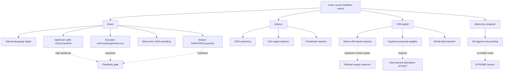

### 2.7 Out of scope

Side-channel exfiltration (timing, URL render, DNS); supply-chain compromise of the inference engine itself or below the GGUF / safetensors layer (compromised CUDA driver, malicious GGML kernels); hardware fault injection beyond detection; physical observation of the device; adversarial fine-tuning of the base model post-deployment; model-extraction attacks; benchmark contamination of the calibration set (mitigated via §19 hash gating but not certified); multimodal image/audio injection (CLIFFGUARD targets text-token streams; multimodal extension is future work).

---

## 3. Theoretical foundations

CLIFFGUARD draws on four theoretical pillars.

### 3.1 Information-theoretic framing

Let $X$ be the input prompt as a token sequence and $Y$ the model's output token sequence. We treat injection detection as a *change-of-source* problem: under benign traffic the joint source $(X, Y)$ has some distribution $P_0$; under injection it has $P_1$. The Neyman–Pearson optimal test is the log-likelihood ratio $\Lambda = \log P_1/P_0$, which CUSUM (Page 1954) accumulates for change-point detection with optimal expected detection delay (Lorden 1971, Moustakides 1986). Pure perplexity gates (Jain et al. arXiv:2309.00614, Alon & Kamfonas arXiv:2308.14132) approximate $\log P_0$ alone; **CLIFFGUARD approximates the ratio** by combining a fixed reference $n$-gram model (KenLM-class) with the protected model's own per-step entropy, so the streaming statistic is

$$\Delta_t = \log P_\text{model}(y_t \mid \text{ctx}) - \log P_\text{ref}(y_t \mid \text{ctx}).$$

For a stream of generated tokens $y_{1:T}$, define per-token entropy $H_t = -\sum_v p(v \mid y_{<t}, q) \log p(v \mid y_{<t}, q)$. TRIPWIRE-H runs a CUSUM detector on the entropy residuals after a stationary baseline $\mu_0$ estimated on the calibration fold:

$$S_t = \max(0, S_{t-1} + (H_t - \mu_0 - \gamma)),\qquad \text{alarm at } S_t > h.$$

A second information-theoretic primitive is the **bottleneck view of refusal** (Tishby et al., physics/0004057; VIB, arXiv:1612.00410): the residual-stream direction $\hat r$ identified by Arditi et al. (arXiv:2406.11717) functions as a near-sufficient statistic for the refusal decision. The signed projection $\rho(x) = \langle h_\ell(x), \hat r \rangle$ at the post-instruction token is a **refusal margin**. We hypothesize and pre-register that this margin's distribution shifts measurably under quantization, even when downstream MMLU scores do not.

### 3.2 Control-theoretic framing

CLIFFGUARD treats the gate stack as a **feedback controller** over a token stream. Let $u_t$ be a per-step risk score derived from gate outputs and let $r_t$ be a per-step reward (negative regret) returned by the LOOKOUT post-hoc judge or by user-side signals (timeout, tool refusal, system canary trip). The CONDUCTOR adjusts a vector of gate weights $w_t \in \mathbb{R}^G$ to minimize expected discounted regret. CUSUM and EWMA are change-point detectors operating in this loop; their thresholds are the controller's reference signals. This is closer in spirit to a moving-target defense (Eghtesad–Vorobeychik–Laszka 2020) than to a static classifier cascade. We require a Lyapunov-style invariant: under the no-attack stationary distribution, the controller state visits the BLOCK absorbing state with probability bounded by FPR_target (per-deployment).

### 3.3 RL-theoretic framing

The gate-weighting problem is a **contextual adversarial bandit**: at each request the context $x_t$ is the (length, language, tool-trace, model-state) feature vector; the action $a_t$ is a sampled subset and weight assignment of gates from $\mathcal{G}$; the reward $r_t$ is observed only when LOOKOUT or out-of-band feedback fires. Because the attacker is adaptive, the natural regret model is adversarial (EXP3, Auer et al. 2002) rather than stochastic; because contexts are informative, we use **LinUCB** (Li et al. WWW 2010, arXiv:1003.0146) as the default policy and EXP3.S (Auer et al. 2002, switching) as the fallback under non-stationary attack distributions (TESSERACT-style drift, arXiv:2402.01359). The closest precedent is AEGIS (Ghosh et al., arXiv:2404.05993), which uses Hedge-style no-regret combination of *full LLM* safety experts; CLIFFGUARD generalizes this to lightweight gates with fine-grained features and to edge-quantized targets.

### 3.4 Interpretability framing

We posit a two-direction safety subspace at the last user-instruction token $t_\text{inst}$. Following Arditi et al. (arXiv:2406.11717) we have a **refusal direction** $r \in \mathbb{R}^d$ at $t_\text{post-inst}$; following Zhao et al. (arXiv:2507.11878, NeurIPS 2025) we have a **harmfulness direction** $h \in \mathbb{R}^d$ at $t_\text{inst}$, demonstrably distinct from $r$. The cross-lingual universality result (arXiv 2505.17306) and the Geometry-of-Refusal work (Wollschläger et al. [unverified — venue]) further support that this subspace is shared across languages and architectures.

**Geometric assumption (G1).** Let $z_t(q)$ denote the residual-stream activation at token $t$ for prompt $q$. There exists a subspace $S = \mathrm{span}\{r, h\} \subset \mathbb{R}^d$ such that for any distribution $P$ over prompts,

$$\|\Pi_S z_{t_\text{inst}}(q) - \Pi_S z_{t_\text{inst}}(q')\| \;\ge\; \xi \cdot \|z_{t_\text{inst}}(q) - z_{t_\text{inst}}(q')\|$$

in expectation over $(q, q') \in $ harmful $\times$ harmless, for some $\xi > 0$ (the safety-subspace fraction). G1 is empirically supported by Arditi et al. and Zhao et al. for instruction-tuned chat LLMs at 7 B–72 B parameters.

**Sensitivity bound.** Let $q' = q + \delta$ be an adversarial perturbation in token-space and let $\pi(q) = \Pi_S z_{t_\text{inst}}(q)$ be the safety projection. If quantization $\tilde q$ acts as a Lipschitz operator on the residual stream with constant $L_{\tilde q}$, then

$$\|\pi(q) - \pi(q')\| \;\le\; L_{\tilde q} \cdot (\|\delta_z\|_2 + 2\, \varepsilon_{\tilde q}),$$

where $\varepsilon_{\tilde q}$ is the per-quantization residual reconstruction error and $\delta_z$ is the induced activation perturbation. This is the formal hook used in §11 to define the cliff: **the cliff is the regime where $\varepsilon_{\tilde q}$ inflates enough that $\pi(q)$ flips sign on harmful prompts**.

---

## 4. Architecture

### 4.1 Component diagram

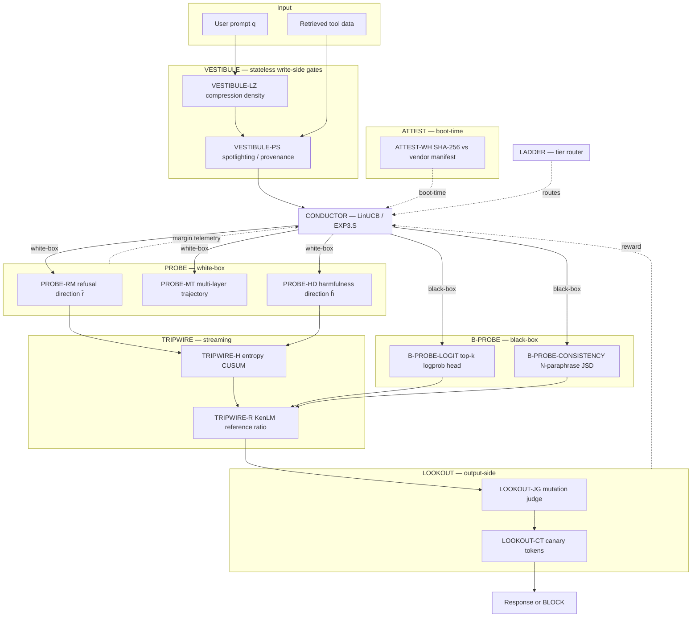

### 4.2 Named components

- **VESTIBULE** runs a stack of fast write-side gates over the raw prompt and any retrieved/tool content, producing per-gate scores $g_1, \ldots, g_G \in [0,1]$. Includes a perplexity gate (KenLM-class), a compression-ratio gate (LZ), an instruction-density gate (verb–entity collisions), an encoding-anomaly gate (non-printable, base-N, ASCII art density), and a structural-segregation / spotlighting gate (Hines et al. arXiv:2403.14720). Stateless across requests; ports across hardware tiers unchanged.
- **PROBE** is a quantization-aware white-box observer attached to the protected model. It does not introduce a separate classifier; it reads (a) the top-$k$ logits and (b) the residual-stream projection onto a pre-computed refusal direction $\hat r$ at $t_\text{post-inst}$ and onto a harmfulness direction $\hat h$ at $t_\text{inst}$, plus the projection's *trajectory* over the last $K_\ell$ layers. Outputs are the **refusal margin** $\rho$, the **harmfulness margin**, the **margin-trajectory slope** $\dot\rho$, and a **margin-confidence interval** computed at boot from a per-quantization calibration.
- **B-PROBE** is the black-box fallback observer for closed-weight endpoints and NPU-frozen graphs without hidden-state access. Computes a logistic-head margin from top-$k$ log-probabilities of the first response token (B-PROBE-LOGIT) and an $N$-paraphrase first-token Jensen–Shannon divergence (B-PROBE-CONSISTENCY).
- **TRIPWIRE** maintains streaming statistics over per-token entropy, cross-entropy ratio against the reference $n$-gram model, and per-token novelty (HyperLogLog over hashed token bigrams). Runs CUSUM and EWMA control charts on these signals. *Operates during decoding* — does not need the full output before raising an alarm.
- **CONDUCTOR** is the LinUCB contextual-bandit policy that selects a gate-weight vector per request, with EXP3.S fallback under drift and a tightened safe-rollback rule. Updates only on reward signals: LOOKOUT verdict, canary-token leakage, tool-call audit failure, user complaint flag.
- **LOOKOUT** is the post-hoc / streaming output judge plus canary loop. On the 8 GB tier it can call a small DeBERTa-class injection classifier ($\le 86$ M params) or a Llama-Guard-3-1B-INT4 instance (440 MB, arXiv:2411.17713) over generated tokens. On lower tiers it falls back to canary-leak detection plus a tiny linear judge on TRIPWIRE features.
- **LADDER** is the tier router. Selects which gates run, at what depth, with what budgets, depending on detected hardware (RAM, VRAM, NPU presence) and observability (white-box / NPU-final-layer / black-box). Configuration, not learning.
- **ATTEST** runs at boot only. Hashes the GGUF / safetensors blob with SHA-256 and compares against a signed vendor manifest. Defends against A2 (Egashira-style poisoned weights) at the supply-chain layer.

### 4.3 ATTEST integration diagram

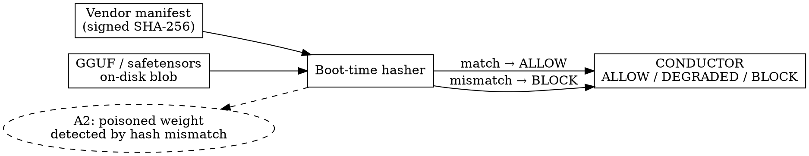

### 4.4 Data flow per request — white-box and black-box paths

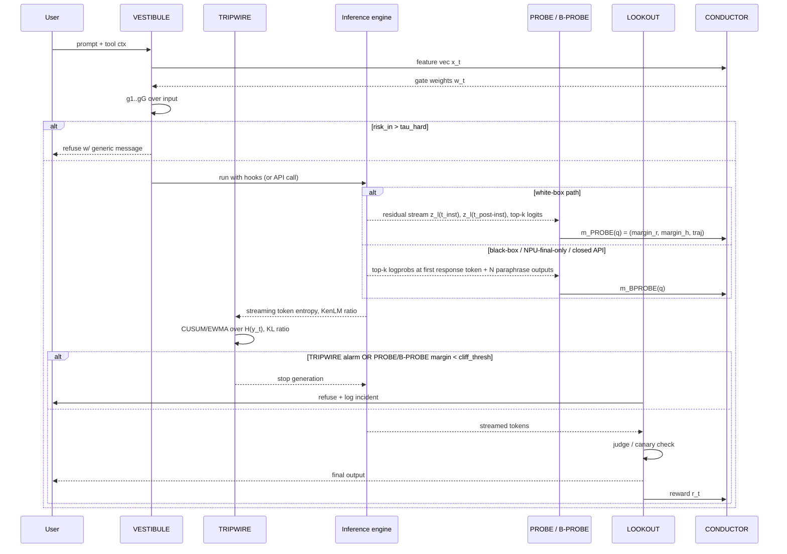

---

## 5. Defense primitives

CLIFFGUARD specifies eleven primitives — eight white-box + black-box-shared, two black-box-only, and one boot-time. They go materially beyond a regex-and-perplexity stack.

### 5.1 Refusal-margin probe (PROBE-RM)

**Idea.** Use the protected model's own residual stream as a sensor. Pre-compute $\hat r$ as the difference-in-means direction between activations on harmful vs. harmless prompts at a chosen (layer $\ell$, position $p$) using Arditi et al.'s recipe. At inference, compute

$$\rho(x) = \frac{\langle h_\ell(x), \hat r \rangle}{\|\hat r\|}$$

at the post-instruction token *before* generation.

**Quantization-aware calibration.** Recompute $\hat r$ once per (model, quantization scheme) pair on a fixed harmful/harmless calibration set $\mathcal{C}$ (we propose AdvBench-50 ∪ Alpaca-50 as $\mathcal{C}$, both small enough to ship hashed). Store the resulting $\hat r_{(M, q)}$ and the empirical 5th/50th/95th percentile of $\rho$ on $\mathcal{C}$ in a calibration table. The gate fires when $\rho < \tau_q$, with $\tau_q$ a per-quantization quantile of the harmless distribution.

**Math.** The Bayes-optimal linear test for {harmless, harmful} given the assumption of class-conditional Gaussian residuals on a 1-D subspace is exactly a threshold on $\rho$. Arditi's experiments support this assumption empirically. Quantization shifts the per-class means; the calibration table absorbs the shift.

**Latency.** On RTX 5060 NF4, a single residual-stream projection at one layer is one $O(d)$ dot-product (~12 µs at $d=4096$). On Pi 5 CPU, ~200 µs. Negligible vs. millisecond-class generation.

**Quantization-impact analysis.** If the cliff hypothesis holds, the per-class margin distributions narrow under more aggressive quantization, increasing FPR at fixed TPR. Calibration absorbs the shift but cannot recover information lost when the distributions overlap. PROBE-RM is therefore **most informative at NF4 and Q4_K_M and degrades at Q3_K_M and below** — precisely where it matters most to detect risk because the model itself is also degraded.

### 5.2 Margin-trajectory probe (PROBE-MT)

**Idea.** Compute $\rho_\ell$ at a small set of layers (e.g. early/middle/late: 25 %, 50 %, 75 % depth) and track the trajectory. Followups to Arditi (arXiv:2507.11878 on harmfulness vs. refusal directions; arXiv:2509.09708 on SAE refusal subcircuits) suggest the *direction along which the residual evolves* is more discriminative than the final-layer projection. We define $\dot\rho = \rho_\text{late} - \rho_\text{mid}$ and $\ddot\rho$ analogously. Adversarial suffixes that "redirect" the model often show characteristic non-monotone trajectories.

**Latency.** $K_\ell = 3$ projections, ~36 µs on GPU, ~600 µs on Pi 5. Acceptable.

**Calibration.** Per-quantization-scheme percentiles, identical procedure to PROBE-RM.

### 5.3 Harmfulness-direction probe (PROBE-HD)

**Idea.** Project the residual stream at the *user-instruction* token $t_\text{inst}$ onto the harmfulness direction $\hat h$ identified by Zhao et al. (2507.11878), which encodes harmfulness independently of refusal. PROBE-RM at $t_\text{post-inst}$ catches the model's response-stage refusal; PROBE-HD at $t_\text{inst}$ catches the model's request-stage harmfulness recognition. Together they form a 2-D safety subspace probe.

**Calibration.** Identical procedure to PROBE-RM on the same fold.

### 5.4 Streaming token-entropy CUSUM (TRIPWIRE-H)

**Idea.** During decoding, compute per-token entropy $H_t = -\sum_v p_t(v) \log p_t(v)$ over the model's top-$k$ softmax. Maintain a one-sided CUSUM on $H_t - \mu_0$ where $\mu_0$ is the per-quantization benign mean. An injection that pushes the model to a forbidden completion typically exhibits an entropy depression (high-confidence forbidden token) followed by an entropy spike (the model "starts and stalls"); GCG-perturbed contexts often show abnormal early entropy.

**Math.** Standard one-sided CUSUM:

$$S_t = \max(0, S_{t-1} + (H_t - \mu_0 - \delta/2)),\qquad \text{alarm if } S_t > h.$$

Threshold $h$ tuned for $\mathrm{ARL}_0 \approx 1000$ tokens (~one false alarm per 1000 benign tokens), which on conversation-scale traffic is roughly one false alarm per 50–100 sessions.

**Storage cost.** A single float per stream. Survives the no-payload-storage constraint trivially.

### 5.5 Reference-ratio gate (TRIPWIRE-R)

**Idea.** Train (offline, once per quantization) a small KenLM 5-gram model on a benign instruction corpus. At decode time, compute $\Delta_t = \log P_M(y_t \mid \text{ctx}) - \log P_\text{ref}(y_t \mid \text{ctx})$. This is the streaming approximation of the Neyman–Pearson log-ratio. Combine with TRIPWIRE-H via a CUSUM over a learned linear combination $\alpha H_t + \beta \Delta_t$, where $(\alpha, \beta)$ is fit on calibration traces.

**Why a fixed reference helps.** Pure perplexity gates are model-dependent; under quantization $P_M$ shifts and the gate must be re-tuned. The reference $n$-gram is fixed, so quantization shifts only $\log P_M$. The ratio is the meaningful signal.

### 5.6 Compression-density gate (VESTIBULE-LZ)

**Idea.** Compute LZ4 / zlib compression ratio $\rho_\text{LZ}(x) = |z(x)| / |x|$ on the input. Adversarial suffixes (GCG-style) and ArtPrompt-style ASCII payloads have characteristic compression signatures: GCG suffixes are *less compressible* than English (near-random tokens); ArtPrompt is *more* compressible than the surrounding text. We use a two-sided gate with empirical thresholds.

**Cost.** ~20 µs / 1 KB. Effectively free.

### 5.7 Provenance-aware spotlight gate (VESTIBULE-PS)

**Idea.** Hines et al. (arXiv:2403.14720) showed that delimiting / datamarking / encoding untrusted spans cuts injection ASR from > 50 % to < 2 % on capable models. We integrate spotlighting *as a gate*: the gate transforms input by datamarking untrusted spans (whitespace replaced by a session-secret marker) and asks the model to track provenance. The gate's score is the model's *self-reported* compliance score from a tiny instruction-tuned head. This is one of the few primitives that benefits from model capability rather than fighting it.

**Edge note.** On 2 GB tiers we omit datamarking and rely on hard-delimited prompts only.

### 5.8 Canary-token loop (LOOKOUT-CT)

**Idea.** Insert a per-session secret token sequence into the system prompt (Rebuff-style). LOOKOUT scans output streams (via a Bloom filter / Count-Min sketch keyed by the secret) for any echo of the canary. A leak indicates extraction-style injection. Crucially the canary is **per-session, never logged**, generated by a CSPRNG and discarded at session end — compatible with the no-storage constraint.

**Math.** Bloom filter with $m = 256$ bits, $k = 3$ hashes gives FPR $\approx 0.001$ at typical canary lengths, with ~32 bytes session state.

### 5.9 KL drift across mutations (LOOKOUT-JG)

**Idea.** A lightweight version of JailGuard / SmoothLLM (arXiv:2310.03684): generate $N \in \{2, 3\}$ character-level mutations of the input on the fly, take *only the first-token distributions* of the model on each, and compute pairwise JS divergence. High divergence on the *first token* of the model's response indicates an unstable input — characteristic of GCG/AutoDAN-perturbed prompts. We do *not* generate full responses; cost is $N$ extra prefill calls of one token each.

**Edge note.** On 8 GB tier feasible at $N = 3$. On Pi 5 we drop to $N = 2$ and skip on 2 GB tier.

### 5.10 Black-box logit observer (B-PROBE-LOGIT)

**Idea.** Let $\ell(q) = (\log p(v_1 \mid q), \ldots, \log p(v_k \mid q))$ be the top-$k$ log-probability vector for the first response token (typically $k \in \{5, 10, 20\}$ depending on API). Train a logistic head $\varphi_\theta : \mathbb{R}^k \to \mathbb{R}$ on the calibration set $\mathcal{C}$ with labels $\in \{$refused, complied$\}$. The B-PROBE-LOGIT margin is $m_\text{BL}(q) = \varphi_\theta(\ell(q))$.

**What it loses geometrically.** The residual-stream refusal direction $r$ is not directly observable; only its projection onto the unembedding $W_U$ is. The first-token logit gap between {"I", "Sure"}-like tokens and {"I cannot", "I'm sorry"}-like tokens is a noisy *linear functional* of $r^\top z$. B-PROBE-LOGIT recovers FPR-portability (Theorem 14.2) but not full discriminative power; **TPR is strictly weaker** and is pre-registered as an empirical question (H3).

### 5.11 Black-box consistency observer (B-PROBE-CONSISTENCY)

**Idea.** Generate $N \in \{2, 3\}$ paraphrases $\pi_1(q), \ldots, \pi_N(q)$ using a small *local* paraphraser (e.g., a 1 B distilled model). Query the closed endpoint on each. Define the divergence

$$D_\text{BC}(q) = \frac{1}{N(N-1)/2} \sum_{i < j} \mathrm{JSD}\!\left(p_\text{first-tok}(\pi_i) \,\|\, p_\text{first-tok}(\pi_j)\right)$$

approximated from top-$k$ log-probabilities. A spike in $D_\text{BC}$ indicates the prompt is on the cliff (small token perturbations flip behavior). Subsumes LOOKOUT-JG into the black-box path.

### 5.12 Weight-hash attestation (ATTEST-WH)

**Idea.** Boot-time SHA-256 over the GGUF / safetensors blob, compared against a vendor-published, signed manifest. (Llama, Qwen, Mistral, Gemma now publish per-file SHA-256 on Hugging Face.) If unavailable, fall back to first-use-trust with a sticky local hash and require manual revocation. ATTEST-WH defends against A2 (Egashira-style poisoned weights, ICLR 2025): even if the FP16 checkpoint hashes correctly, a substituted GGUF blob is rejected at boot. ATTEST-WH is **not** a substitute for runtime gates — Egashira showed that the attack space within a quantization interval is non-empty even for valid GGUF files — but combined with ATTEST it forces the attacker to additionally compromise the supply chain.

### 5.13 Primitive summary

| # | Primitive | Site | Cost (8 GB GPU) | Quant-sensitive? | Calibration |
|---|---|---|---|---|---|
| 5.1 | PROBE-RM | Pre-decode hidden | ~12 µs | yes (per scheme) | calibration set |
| 5.2 | PROBE-MT | Pre-decode hidden ×3 | ~36 µs | yes | per scheme |
| 5.3 | PROBE-HD | Pre-decode hidden $t_\text{inst}$ | ~12 µs | yes | per scheme |
| 5.4 | TRIPWIRE-H | Per-token logits | per-token µs | mild | $\mu_0$ per scheme |
| 5.5 | TRIPWIRE-R | Per-token logits + KenLM | ~50 µs/tok | model-side only | ref LM fixed |
| 5.6 | VESTIBULE-LZ | Input string | ~20 µs | none | offline |
| 5.7 | VESTIBULE-PS | Input transform | ~ms | none | offline |
| 5.8 | LOOKOUT-CT | Output stream | µs | none | per-session |
| 5.9 | LOOKOUT-JG | Pre-decode ×$N$ | $N \times$ prefill | mild | offline |
| 5.10 | B-PROBE-LOGIT | API top-k logprob | ~one API call | n/a | logistic head |
| 5.11 | B-PROBE-CONSISTENCY | $N$ paraphrase API calls | $N \times$ API | n/a | offline |
| 5.12 | ATTEST-WH | Boot-time | seconds (boot only) | n/a | vendor manifest |

---

## 6. RL adaptation layer

### 6.1 Bandit feedback loop

```dot
digraph G {
  rankdir=LR; node [shape=box, style=rounded];
  ctx [label="Context x_t\n(len, lang, tool-trace, tier)"];
  pol [label="LinUCB policy\n(per-arm A_a, b_a)"];
  arm [label="Action a_t\n= weighted gate subset"];
  env [label="Request executes\nwith chosen gates"];
  out [label="Outcome\n{block, allow, complaint, canary, audit}"];
  rew [label="Reward r_t\nin [-1, +1]"];
  upd [label="A_a += x x^T\nb_a += r x"];
  ctx -> pol -> arm -> env -> out -> rew -> upd -> pol [label="next req"];
}
```

### 6.2 Formulation

- **Arms.** A finite menu $\mathcal{A}$ of preset gate-weight vectors plus a small number of "exploration arms" with high-cost / low-cost trade-offs. Typical $|\mathcal{A}| = 8$–16 to keep regret bounds tight.
- **Context.** $x_t \in \mathbb{R}^d$ with $d \approx 32$: prompt length, char-entropy, language ID, has-tool-context flag, time-of-day bucket, hardware tier, recent-incident rate (EWMA), TRIPWIRE-H baseline drift estimate, etc. **No payload-derived features** that could constitute identifiable content beyond aggregates.
- **Policy.** LinUCB:

$$a_t = \arg\max_a \left( x_t^\top \hat\theta_a + \alpha \sqrt{x_t^\top A_a^{-1} x_t} \right),$$

with $A_a = \lambda I + \sum_{s : a_s = a} x_s x_s^\top$, $b_a = \sum r_s x_s$, $\hat\theta_a = A_a^{-1} b_a$. Regret $\tilde O(\sqrt{dT})$ in stochastic regime.
- **Adversarial fallback.** If incident-rate EWMA crosses a threshold, switch to EXP3.S (Auer et al. 2002), which gives $\tilde O(\sqrt{KTS})$ regret for $S$ switches — appropriate during a coordinated attack campaign.
- **Reward.** $r_t = +1$ for benign-served (LOOKOUT clean, no canary trip, no audit fail), $-1$ for confirmed injection that slipped (canary trip OR audit fail OR delayed user flag), $-0.2$ for false positive (block on later-confirmed-benign request, e.g. user retries unmodified and succeeds). Reward is sparse and delayed — typical of bandits in security; we use importance-weighted updates following AEGIS (arXiv:2404.05993).

### 6.3 Pre-registered reward function

Before any experiment we commit to:

$$r_t = \mathbb{1}[\text{served} \land \text{clean}] - \mathbb{1}[\text{served} \land \text{injected}] - 0.2 \cdot \mathbb{1}[\text{blocked} \land \text{benign}].$$

Pre-registration is necessary because reward shaping post-hoc would invalidate the bandit's regret claims and would trivially let us tune toward favorable numbers. We follow TESSERACT-style hygiene (arXiv:2402.01359) for temporal evaluation.

### 6.4 Concept drift handling

Three mechanisms: (i) ADWIN (Bifet & Gavaldà 2007) on the per-arm reward stream — when ADWIN flags drift on arm $a$, its $A_a, b_a$ are partially decayed; (ii) sliding-window forgetting on $A_a$ with half-life $\tau_a$ (default $10^4$ requests); (iii) the EXP3.S fallback for active-attack regimes. Kim-Hammar-style adaptive conjectures (2024) inform the design.

### 6.5 Defender-aware safe rollback

To address A8, we tighten v1's safe-rollback rule. Let $R_t$ denote the cumulative empirical regret of CONDUCTOR's policy over the last $W$ rounds. Let $A_t$ denote the cumulative ABR (attack bypass rate) estimated from canary collisions and judge verdicts. **If $A_t$ exceeds a pre-registered threshold $A_\text{max}$ for two consecutive windows, rollback to the static maximum-coverage policy** (run all primitives, accept FPR cost) for $K$ rounds before resuming bandit exploration.

**Regret-vs-attack-budget tradeoff.** Under EXP3.S with a defender-aware adversary holding an attack budget $B$ (number of adversarial prompts injected per $N$ total), the regret bound is $O(\sqrt{NK \ln K} + B \cdot \Delta_\text{max})$ where $\Delta_\text{max}$ bounds per-arm gap. The $B \cdot \Delta_\text{max}$ term is the price of adaptivity. We trade exploration (higher information gain) for exploitation (tighter regret) by reducing $\alpha$ in LinUCB whenever ATTEST-WH or LOOKOUT-CT report any evidence of A8 activity.

### 6.6 Privacy

Bandit storage is the per-arm pair $(A_a, b_a)$ — symmetric matrices and vectors with $d \approx 32$ entries, totaling a few KB across all arms. **No payload, no token, no embedding is stored.** Reward signals are scalar.

---

## 7. Signal-processing layer

### 7.1 Pipeline

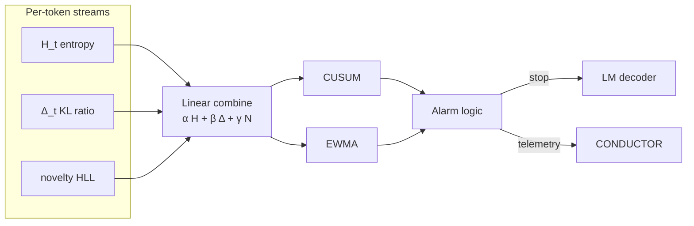

### 7.2 Streaming entropy

Per-token entropy $H_t$ is computed exactly from the top-$k$ softmax (truncated to $k = 64$ for cost). For aggregate session-level entropy estimation we use the Chakrabarti–Cormode–McGregor near-optimal stream entropy estimator (ACM TALG 6(3):51, 2010) with $\varepsilon = 0.05$ — total memory $O(\log m)$.

### 7.3 Change-point: CUSUM, EWMA, Page–Hinkley

We deploy CUSUM as the primary change-point detector for one-sided shifts (decreased entropy on forbidden-token completion). EWMA ($\lambda = 0.1$, $L = 2.7$, $\mathrm{ARL}_0 \approx 500$) supplements for slow drift. Page–Hinkley (River default) is included as the fallback on the 2 GB tier where we cannot afford the full reference-LM evaluation. Thresholds are pre-registered per quantization scheme based on calibration runs over Alpaca-eval and OpenAssistant benign chats.

### 7.4 Sketches

**HyperLogLog** (Flajolet et al. 2007) over hashed token bigrams, $m = 1024$ registers (~1.5 KB), to track session-level token novelty. **Count-Min sketch** ($w \times d = 256 \times 4 = 1$ KB) on canary-token lookups in LOOKOUT. These satisfy the "near-stateless" criterion: total persistent state across sessions is well under 10 KB plus the bandit matrices.

### 7.5 Kernel anomaly score

For optional per-deployment diagnostics on the 8 GB tier we maintain an online kernel two-sample test (Wei & Xie, arXiv:2211.15070, KCUSUM) between a rolling window of recent margin vectors $(\rho, \dot\rho, \ddot\rho)$ and a calibrated benign reference window. This is **not** in the inference fast path; it runs once per $K$ requests as a drift detector for CONDUCTOR.

---

## 8. Quantization-aware components

### 8.1 The quantization-impact gate sequence

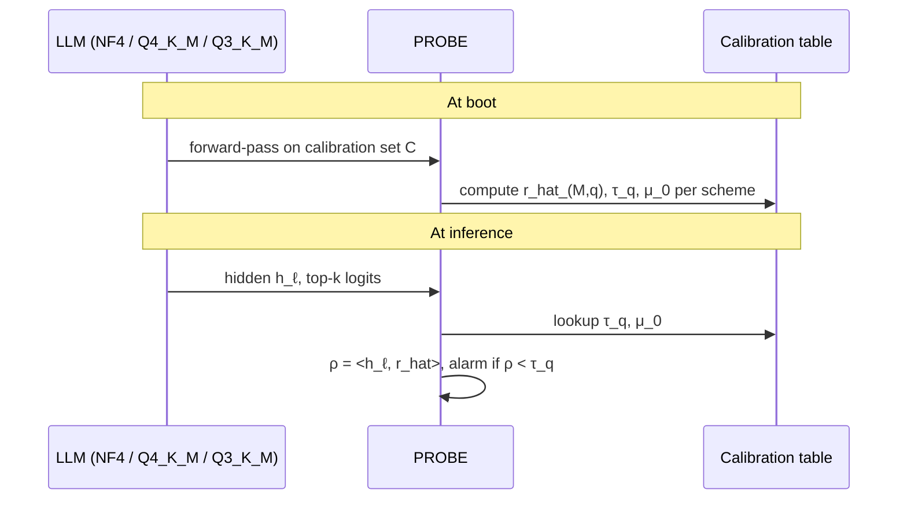

### 8.2 NF4-specific notes

NF4 (Dettmers et al. arXiv:2305.14314) places quantization levels at quantiles of $\mathcal{N}(0,1)$. Refusal-direction projections involve dot products with weights; NF4's near-zero precision concentration means the tails (where outlier weights live) are coarsely quantized — exactly where Wei et al. (arXiv:2402.05162) showed "<1 % of weights" can carry safety. **Hypothesis (pre-registered):** NF4 produces small but measurable shifts in $\rho$ relative to FP16, mostly via tail-heavy weight rounding; Q3_K_M produces larger shifts because of additional sub-block rounding optimization.

### 8.3 Q4_K_M / Q3_K_M (GGUF k-quants)

GGUF k-quants use super-block + sub-block scales tuned by iterative MSE optimization (Mind the Gap, arXiv:2505.23786). The MSE objective does not preserve refusal-direction projection. Calibration must therefore **measure** rather than predict $\hat r_{(M, q)}$.

### 8.4 INT8 (LLM.int8(), arXiv:2208.07339)

INT8 with outlier mixed precision is near-lossless on accuracy and (we predict) on $\rho$. PROBE thresholds calibrated for FP16 will likely transfer with minor adjustment.

### 8.5 Quantization-evidence table (with 2025–2026 evidence)

| Scheme | Expected margin shift | FPR shift | Recalibration burden | Cliff evidence | Source |
|---|---|---|---|---|---|
| FP16 | reference | reference | n/a | n/a | — |
| INT8 (LLM.int8()) | small | small | low | minimal alignment loss in published benchmarks; CC++-style probes work well | bitsandbytes; Sharma et al. 2501.18837 |
| NF4 (bitsandbytes) | moderate | moderate | medium | small but measurable safety regression; outlier-channel sensitive | Hong et al. 2403.15447 |
| AWQ-INT4 | small–moderate | small–moderate | low–medium | activation-aware salient-weight protection mitigates regressions | Lin et al. 2024 |
| GGUF Q6_K, Q5_K_M | small | small | low | benign in clean models; **adversarially exploitable** by Egashira | OpenReview TV17MLZGuA |
| GGUF Q4_K_M | moderate | moderate | medium | most-deployed format; mild safety drift, large attack surface for A2/A7 | Egashira; AAQ/CAQ 2511.07842 |
| GGUF Q3_K_M, IQ3_XXS | large (cliff candidate) | large | high | **measured cliff**: ASR Δ up to 88.7 % insecure-code, 85.0 % content-injection, 30.1 % over-refusal | Egashira |
| GGUF Q2_K, IQ2_XXS | catastrophic | unstable | gate may be unusable | severe quality regression overlaps with safety regression | community reports |
| RKNN W8A8 (NPU) | mixed | mixed | per-channel calibration required | depends on per-channel calibration; PROBE-MT infeasible | Rockchip RKNN docs |

The CAQ / AAQ result (arXiv 2511.07842, Wee et al., 2025–2026) is the strongest recent prior result motivating CLIFFGUARD: post-training quantization optimized only for reconstruction error (MSE / KL) systematically degrades behavioral alignment even when perplexity is preserved — directly motivating why behavioral metrics ($\Delta_B$-cliff, §11) are not redundant with geometric ones ($\Delta_\text{cliff}$). Magnitudes are pre-registered as hypotheses, not claims.

---

## 9. Composition and gate ordering

### 9.1 Defense composition matrix

| Stage | Gate | Purpose | Worst-case latency cost | Failure mode |
|---|---|---|---|---|
| 0. Boot-time | ATTEST-WH | reject substituted weights | seconds (boot only) | unsigned manifest → first-use trust |
| 1. Pre-prompt | VESTIBULE-LZ | reject obvious GCG suffix | ~20 µs | misses NL injections |
| 2. Pre-prompt | VESTIBULE-PS | mark untrusted spans | ~ms | high-capability bypass |
| 3. Pre-decode | PROBE-RM | refusal margin | ~12 µs | masked by quant shift |
| 4. Pre-decode | PROBE-MT | trajectory | ~36 µs | noisy at low layer |
| 4b. Pre-decode | PROBE-HD | harmfulness margin | ~12 µs | requires intermediate-layer access |
| 4c. Pre-decode (BB) | B-PROBE-LOGIT | black-box logit head | one API call | strictly weaker TPR |
| 5. Pre-decode | LOOKOUT-JG / B-PROBE-CONSISTENCY | input stability | $N \times$ prefill / API | costly on Pi 5 |
| 6. Decoding | TRIPWIRE-H | entropy CUSUM | per-token µs | benign topic shifts |
| 7. Decoding | TRIPWIRE-R | KL ratio | ~50 µs/tok | reference-LM staleness |
| 8. Output stream | LOOKOUT-CT | canary leak | µs | irrelevant if no extraction |
| 9. Output stream | LOOKOUT classifier | judge | tens of ms | classifier brittleness |

### 9.2 Ordering rationale

The order is **cheapest-first**, **most-quantization-robust-first**, with hard-fail short-circuits. ATTEST runs only at boot. VESTIBULE rejects obvious gibberish before the model fires. PROBE checks refusal margin **before** any tokens are generated. TRIPWIRE allows graceful early termination during decoding. LOOKOUT closes the loop. The CONDUCTOR adjusts only the *weights and presence* of stages 2, 4c/5, 7, 9 — the others are mandatory at all tiers because they are nearly free.

### 9.3 Conflict resolution

Each gate emits a score in $[0, 1]$. Aggregate risk $R(x) = \sigma(w_t^\top g(x))$ with sigmoid $\sigma$. We define three thresholds: $\tau_\text{soft}$ triggers reduced sampling temperature and TRIPWIRE-strict mode, $\tau_\text{med}$ triggers VESTIBULE-PS rewriting and LOOKOUT-JG, $\tau_\text{hard}$ triggers refusal. Pre-registered defaults: $\tau_\text{soft} = 0.3$, $\tau_\text{med} = 0.6$, $\tau_\text{hard} = 0.85$. Weights $w_t$ adapt; thresholds are fixed at deployment to keep the controller stable.

When PROBE and VESTIBULE disagree (PROBE says safe, VESTIBULE says risky, or vice versa), CONDUCTOR's Bayesian view of arm rewards adjudicates via the linear combination, so disagreement is implicitly resolved by weight allocation.

---

## 10. MVDS for four edge tiers

### 10.1 Tier comparison

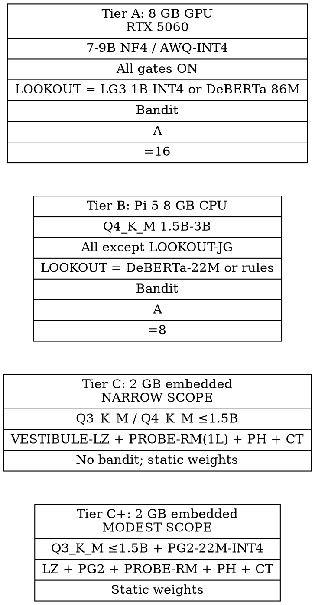

### 10.2 Tier A — RTX 5060 8 GB

Target model: Qwen-2.5-7B / Llama-3-8B in NF4 (bitsandbytes) or AWQ-INT4. Memory budget: ~5 GB model + ~1 GB KV cache @ 4 K ctx + ~0.6 GB classifier (DeBERTa-86M FP16 or Llama Guard 3-1B-INT4 at 440 MB) + ~0.4 GB engine overhead $\approx 7$ GB used, leaving 1 GB headroom. All gates active; LOOKOUT-JG with $N = 3$. PROBE-RM + PROBE-MT + PROBE-HD over residual streams via `output_hidden_states=True`. CONDUCTOR runs full LinUCB with $|\mathcal{A}| = 16$.

### 10.3 Tier B — Raspberry Pi 5 8 GB

Target model: Qwen-2.5-1.5B or 3B Q4_K_M (~0.9 GB / 1.8 GB), running ~5–7 tok/s and ~3–5 tok/s respectively per Stratosphere Lab's 2025 measurements. Memory budget: model + ~0.5 GB KV + ~0.3 GB classifier (DeBERTa-22M or PromptGuard 2-22M, ~88 MB FP16) + OS / llama.cpp overhead. We omit LOOKOUT-JG because $N$ extra prefills would more than double per-request latency. We run TRIPWIRE-H and TRIPWIRE-R but with reduced top-$k$ ($k = 16$). Substrate: llama.cpp ARM64 with eval-callback enabled OR a small fork patch exposing intermediate residuals (§18.4); models — Llama-3.2-1B, Qwen2.5-1.5B, Phi-3-mini at Q4_K_M. CONDUCTOR is reduced to $|\mathcal{A}| = 8$. B-PROBE-CONSISTENCY substitutes for LOOKOUT-JG when extra prefills are too expensive.

### 10.4 Tier C — 2 GB embedded (HONEST SCOPE)

Target model: TinyLlama-1.1B or Qwen-2.5-0.5B/1.5B in Q3_K_M / Q4_K_M, running on RK3588 NPU W8A8 (10–15 tok/s on 1.1B per tinycomputers.io) or Pi 4 / Jetson Orin Nano 4 GB. Only VESTIBULE-LZ, a single-layer PROBE-RM-final, Page–Hinkley on entropy, and LOOKOUT-CT canary check. **No bandit** — gate weights are fixed at deployment because the data rate is too low and incident reward signal too sparse to learn online; CONDUCTOR falls back to a static expert-tuned policy with EWMA-based drift alarms only.

**Plain-language statement: Tier C is *not* meaningfully defended against A7 (cliff exploiter).** Tier C runs Q3_K_M models in 2 GB, the regime where the Egashira-GGUF and Hong et al. (2403.15447) cliffs are most likely. The minimal stack raises the attacker cost only marginally.

**Recommendation.** Tier C is suitable **only** for:

- Single-task Jatmo-style assistants (Piet et al., arXiv:2312.17673) with a fixed input grammar (e.g., "translate the following Slovenian invoice"; "summarize the following weather report").
- Narrow-domain controlled-input deployments (industrial sensors, fixed UI dropdowns).
- Read-only assistants where any tool side-effects are mediated off-device.

**Not suitable for:** open-domain chat, agentic tool use, retrieval over untrusted data, multi-turn reasoning. Tier C deployments must ship with a label: **"NOT FOR OPEN-DOMAIN ADVERSARIAL USE."** When PROBE-RM-final confidence is low, the recommended fallback is a deterministic rule-based handler (regex template-match), *not* a different LLM completion.

### 10.5 Tier C+ — 2 GB embedded with PromptGuard-2-22M (modest open scope)

Same hardware budget as Tier C. Replaces "no dedicated classifier" with a small Meta PromptGuard-2-22M classifier (DeBERTa-xsmall, 22 M parameters; ~86 MB FP16 / ~25–30 MB INT4 estimated, MIT-licensed via mDeBERTa lineage; meta-llama/Llama-Prompt-Guard-2-22M model card). PromptGuard-2 classifies inputs as benign or malicious with a custom energy-based loss for OOD robustness (LlamaFirewall paper, arXiv 2505.03574).

**Memory budget (Tier C+).** Q3_K_M base model ~1.4 GB + KV cache ~150 MB + PromptGuard-2-22M-INT4 ~30 MB + PROBE-RM final-layer projector + scratch ~50 MB $\approx 1.65$ GB, fitting under 1.8 GB total.

**Residual risk surface (Tier C+).** PromptGuard-2 is trained on known prompt-injection / jailbreak patterns and improves precision over PromptGuard-1 via an energy-based OOD loss (Liu et al. 2020 lineage). It does **not** defend against:

- A2 (poisoned weights — handled by ATTEST-WH).
- A7 cliff exploiters that produce *behaviorally compliant looking* prompts — PromptGuard-2 has no internal-state visibility.
- Subtle multi-turn drift (A4) — PromptGuard-2's 512-token context window forces chunking for long sessions.

Tier C+ thus reduces but does not eliminate Tier C's structural weakness; we pre-register H5 to test this.

### 10.6 Per-tier latency budgets (qualitative)

```mermaid
gantt
  title Per-request latency budget by tier (qualitative; not measured)
  dateFormat X
  axisFormat %s
  section Tier A (8 GB GPU)
  VESTIBULE        :a1, 0, 1
  PROBE pre-decode :a2, after a1, 1
  LOOKOUT-JG (N=3) :a3, after a2, 3
  Generation       :a4, after a3, 30
  TRIPWIRE per-tok :a5, after a3, 30
  LOOKOUT classify :a6, after a4, 5
  section Tier B (Pi 5 CPU)
  VESTIBULE        :b1, 0, 1
  PROBE pre-decode :b2, after b1, 2
  Generation       :b4, after b2, 60
  TRIPWIRE per-tok :b5, after b2, 60
  LOOKOUT-CT/judge :b6, after b4, 5
  section Tier C / C+ (2 GB)
  VESTIBULE        :c1, 0, 2
  PG2 (C+ only)    :c2a, after c1, 4
  PROBE 1-layer    :c2, after c2a, 5
  Generation       :c4, after c2, 80
  TRIPWIRE-PH      :c5, after c2, 80
  Canary check     :c6, after c4, 1
```

(Magnitudes are illustrative, not measured.)

---

## 11. Safety cliff: formal definition

### 11.1 Geometric cliff $\Delta_\text{cliff}$

Let $M$ be a base model and $M_q$ its quantization to scheme $q$. Let $\mathcal{H}$ be a held-out harmful-instruction set (e.g. AdvBench-50) and $\mathcal{B}$ a benign set (e.g. Alpaca-50). Define the **refusal margin distribution** $\mathcal{R}_q^\mathcal{H}$ as the empirical distribution of $\rho_q(x) = \langle h_\ell^{(q)}(x), \hat r_q \rangle / \|\hat r_q\|$ for $x \in \mathcal{H}$, and analogously $\mathcal{R}_q^\mathcal{B}$ for benign.

Define the **separation** at scheme $q$ as

$$\Delta_q = \mathrm{med}(\mathcal{R}_q^\mathcal{B}) - \mathrm{med}(\mathcal{R}_q^\mathcal{H}),$$

and the **safety-cliff metric** between scheme $q$ and a reference scheme $q^*$ (FP16) as

$$\Delta_\text{cliff}(q; q^*) = \frac{\Delta_{q^*} - \Delta_q}{\Delta_{q^*}}.$$

A **safety cliff** between $q_1$ and $q_2$ (more aggressive) exists when

$$\Delta_\text{cliff}(q_2; q^*) - \Delta_\text{cliff}(q_1; q^*) \;\ge\; \kappa,$$

for a pre-registered $\kappa = 0.25$ (i.e., the marginal degradation between $q_1$ and $q_2$ cuts a quarter or more of the FP16 safety margin).

### 11.2 Wasserstein variant $\Delta_W$-cliff

Tail behavior matters for adversarial regimes. Define

$$\Delta_W\text{-cliff}(M, q; q^*) = W_2(P_q, P_{q^*})$$

where $P_q$ is the empirical distribution of $\rho_q(x)$ over $\mathcal{H}$. $W_2$ captures movement of the lower tail of refusal margin (the operationally dangerous tail) that the median misses.

### 11.3 Behavioral cliff $\Delta_B$-cliff (breaks circularity)

The hidden-state metric is potentially circular: PROBE-RM is built from $\hat r$, and $\Delta_\text{cliff}$ is built from $\hat r$; both are geometric functionals of the same residual stream. We add a behaviorally grounded cliff metric measured on a *separate* judge stack that does not depend on hidden states:

$$\Delta_B\text{-cliff}(M, q; q^*) = | C_{M,q}(\mathcal{H}) - C_{M,q^*}(\mathcal{H}) |$$

where $C_{M,q}(\mathcal{H})$ is the agreement-required compliance rate on $\mathcal{H}$ under the **judge stack $J = $ StrongREJECT (arXiv:2402.10260) $\land$ Llama-Guard-3-8B**, both classifying the response as harmful-and-substantively-helpful.

### 11.4 Pre-registered cliff hypothesis (H1)

The cliff exists for $(M, q)$ if and only if **both** $\Delta_\text{cliff}$ and $\Delta_B$-cliff exceed $\kappa$ at the same boundary, on at least 2 of 3 model families $\in $ {Llama-3.x family, Qwen-2.5/3 family, Mistral-Small / Gemma-2/3 family}, with $\kappa = 0.25$ set on Fold A (calibration). Validation requires geometric and behavioral metrics to agree; **disagreement falsifies the design center of PROBE-RM**.

We further hypothesize, for $q^* = $ FP16 and $q \in $ {Q5_K_M, Q4_K_M, NF4, Q3_K_M, Q2_K}:

- $\Delta_\text{cliff}$ is **monotone non-decreasing** in aggressiveness,
- a **cliff** occurs at the Q4_K_M $\to$ Q3_K_M boundary (i.e. that boundary will exhibit $\ge \kappa$ jump on at least 2 of 3 test models),
- Q2_K shows catastrophic margin collapse,
- the cliff is **decoupled from MMLU degradation** (consistent with Hong et al. arXiv:2403.15447).

### 11.5 Cliff diagram

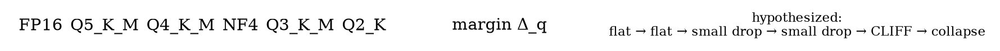

---

## 12. Empirical evaluation plan (non-circular, pre-registered)

### 12.1 Pre-registration discipline

All thresholds, reward functions, calibration sets, and cliff parameter $\kappa$ are committed to a public preregistration repository (OSF + arXiv) before any data is collected. We report negative results.

### 12.2 Five strictly separated folds

| Fold | Purpose | Constructed from | Used to compute |
|---|---|---|---|
| **A — Calibration** | Estimate $\hat r$, $\hat h$, $\mu_0$ (entropy baseline), $\tau_q$ thresholds, KenLM corpora | 2 K benign + 2 K refused prompts from public Anthropic-HH, OASST, OpenAssistant subsets | $\hat r_{(M,q)}$, $\hat h_{(M,q)}$, $\tau_q$, $\mu_0$, KenLM 5-gram |
| **B — Cliff measurement** | Test H1 ($\Delta_\text{cliff}$ & $\Delta_B$-cliff agree) | AdvBench + HarmBench (arXiv:2402.04249) **held out from A** | $\Delta_\text{cliff}$, $\Delta_W$-cliff, $\Delta_B$-cliff |
| **C — Defense composition** | Measure ABR / FPR per primitive and full stack | JailbreakBench (arXiv:2404.01318), AgentDojo (arXiv:2406.13352, with US/UK AISI adaptive attacks where available), InjecAgent (arXiv:2403.02691), GCG (arXiv:2307.15043), AutoDAN (arXiv:2310.04451), PAIR (arXiv:2310.08419), TAP (arXiv:2312.02119), Crescendo (arXiv:2404.01833), ArtPrompt (arXiv:2402.11753), BoN (arXiv:2412.03556), TensorTrust (arXiv:2311.01011) | per-primitive ABR, FPR; composition curves |
| **D — Bandit / online drift** | Test CONDUCTOR under A8 + non-stationary drift | streaming mixture of C with synthetic distribution shifts | regret, rollback frequency |
| **E — BCN-2 (non-circular dataset construction)** | Build below-cliff naturals without assuming cliff exists in the test family | Paraphrases generated by **Mistral-7B-base (non-RLHF, non-test-family)** of AdvBench, filtered by FP16 refusal on the *test* family (Llama-3 / Qwen-2.5), evaluated at Q3_K_M | Held-out BCN-2 corpus for A7 evaluation in Fold C |

The **BCN-2 protocol** is the central anti-circularity move: the dataset's *construction filter* uses the FP16 model's behavior, not the quantized model's; the *paraphrasing engine* is from a different family than the test family; and the cliff being tested is a property of the test family at low bit-width that is *independent* of the construction filter.

Alternative non-circular constructions we also pre-register (any of which can substitute):

- **Mechanistic-interpretability-derived candidates.** Use the harmfulness direction $\hat h$ (Zhao et al. 2507.11878) at FP16 to identify natural prompts whose harmfulness projection is high but whose refusal projection is borderline; predict that quantization will tip them past the refusal threshold.
- **Distribution-shift-based cliff.** Operationalize cliff as $W_2(P^\text{FP16}, P^{\text{Q3\_K\_M}})$ on the *first-token output distribution* over a benign-instruction corpus, requiring no behavioral compliance flip definition.

**Storage discipline.** BCN-2 prompts are stored as locality-sensitive hashes, not raw text — to minimize the dual-use risk and to obey the no-storage discipline of the deployment side. Clear-text release is gated per §19.

### 12.3 Models

Three backbones at six quantizations each (FP16, Q5_K_M, Q4_K_M, NF4, Q3_K_M, Q2_K): Qwen-2.5-1.5B-Instruct, Qwen-2.5-7B-Instruct, Llama-3.1-8B-Instruct. Optionally Phi-3-mini, Gemma-2-2B for Tier C; Mistral-Small / Gemma-2/3 family as third test family.

### 12.4 Phases

- **Week 1 — calibration (Fold A).** Compute $\hat r_{(M,q)}$, $\hat h_{(M,q)}$, $\tau_q$, $\mu_0^{(q)}$ for each (model, scheme). Build KenLM 5-gram. Pre-register all thresholds.
- **Week 2 — cliff measurement (Fold B).** Compute $\Delta_q$, $\Delta_\text{cliff}$, $\Delta_W$-cliff, $\Delta_B$-cliff across schemes. Test H1. Falsifiable: if no scheme exhibits $\ge \kappa$ jump in *both* metrics on at least 2 of 3 families, the hypothesis is rejected and PROBE-RM's quantization-aware story weakens.
- **Week 3 — defense composition (Fold C, BCN-2 plug-in from Fold E).** ABR / FPR per gate, per scheme, per attack family; ablations dropping each primitive; latency budgets measured per tier.
- **Week 4 — bandit and drift (Fold D).** Online LinUCB on synthetic mixed traffic with adversarial drift episodes. Compare against fixed-weight cascade and AEGIS-style Hedge. Measure regret, FPR / TPR over time.

### 12.5 Statistical-power calculation (pre-registered)

For H1 with $\kappa = 0.25$, $\alpha = 0.05$, power $0.8$, two-sided two-sample t-test on median margins. Using Hong et al.'s reported per-quantization variance $\sigma \approx 0.18$ (qualitative reproduction; we will refit $\sigma$ on Fold A before unblinding), the minimum sample size per $(M, q)$ cell is

$$n_\text{min} = \frac{2 \cdot (z_{1 - \alpha/2} + z_{1 - \beta})^2 \cdot \sigma^2}{\kappa^2} \approx \frac{2 \cdot (1.96 + 0.84)^2 \cdot 0.0324}{0.0625} \approx 8.1.$$

We pre-register **$n = 200$ per $(M, q)$ cell** ($\gg n_\text{min}$) to absorb covariance with prompt-difficulty stratification, multilingual subgroups, and the BCN-2 cross-family construction. Total Fold B sample: 3 families $\times$ 6 quantizations $\times$ 200 = 3 600 prompts.

### 12.6 Judge-stack pre-registration

Judges fixed before unblinding: **StrongREJECT v1 (arXiv:2402.10260) + Llama-Guard-3-8B (arXiv:2411.17713-lineage)**, agreement-required (both must label compliance-and-harmful). Tie-breaks: human adjudication on a 5 % stratified sample. Any change to the judge stack after Fold B unblinding requires a public preregistration amendment.

### 12.7 Metrics

ABR (per attack family), FPR (overall and per benign category), macro-F1, average latency overhead per tier, regret of the bandit, calibration drift over time. **No headline ABR / FPR numbers are predicted in this blueprint.**

### 12.8 Threats to validity

Judge variance (Llama-Guard / GPT-4 disagree by ~5–10 pp on jailbreak ASR), benchmark contamination, prompt-template idiosyncrasies. We pre-register the judge stack and rotate prompt templates.

---

## 13. Expected results — qualitative directional predictions

We commit to five directional predictions and pre-register that the experiment can falsify them.

1. **(P1) Cliff exists.** We expect the Q4_K_M $\to$ Q3_K_M boundary to show $\Delta_\text{cliff} \ge \kappa$ on at least 2 of 3 families (Qwen-7B, Llama-3-8B, Qwen-1.5B / Mistral / Gemma). NF4 will look "between Q4_K_M and Q3_K_M". If neither boundary shows the jump, the cliff hypothesis is rejected.
2. **(P2) Decoupling from MMLU.** We expect MMLU drop between Q4_K_M and Q3_K_M to be small relative to refusal-margin collapse, replicating Hong et al.'s qualitative finding (arXiv:2403.15447).
3. **(P3) PROBE-RM survives quant.** Per-quantization calibration recovers most of the FP16 separation; PROBE-RM remains the highest-yield gate at NF4 and Q4_K_M, weaker at Q3_K_M. PROBE-RM FPR after per-quantization calibration varies $< 0.02$ across schemes (H2).
4. **(P4) Composition gain and bandit advantage.** Full primitive stack ABR $< 0.5 \times$ best-single-primitive ABR at matched FPR (H4). LinUCB CONDUCTOR achieves lower cumulative regret than a fixed equal-weight cascade across the 4-week stream, and EXP3.S beats LinUCB during synthetic attack-burst windows.
5. **(P5) Geometric–behavioral agreement.** $\Delta_\text{cliff}$ and $\Delta_B$-cliff agree on the cliff location (correlation $> 0.7$) on H1-positive cells. **Disagreement falsifies the PROBE-RM design center**: if the geometric metric is not behaviorally grounded, the refusal-direction-margin gate is signaling something other than safety.

We deliberately do *not* predict an ABR.

---

## 14. Decoupling theorem

### 14.1 Statement (Theorem 14.1, white-box)

Let $M$ be a base model and $M_q$ its quantization. Let $\mathcal{G}_\text{write} = \{g_1, \ldots, g_W\}$ be the set of write-side gates that operate either on (a) the input string $x$, (b) sketch features of $x$, or (c) summary statistics $\phi(M_q(x)) = (\rho, \dot\rho, H_t, \Delta_t, \ldots)$ extracted from the model's logits / hidden states at a fixed layer. Let $\mathcal{P}_q$ be a per-quantization calibration map fixing thresholds $\tau_q, \mu_0^{(q)}$ for these gates, parameterized by threshold $\tau_q$ calibrated on a held-out set $\mathcal{C}$ of benign prompts to achieve FPR $\alpha$. Assume the per-quantization refusal margin distribution $P_q^\text{benign}$ has finite second moment and a continuous CDF $F_q$.

**Theorem (FPR-decoupling, white-box).** *Under the assumption that calibration map $\mathcal{P}_q$ is computable from a finite calibration set $\mathcal{C}$ on $M_q$, the false-positive rate of $\mathcal{G}_\text{write}$ on a benign distribution $\mathcal{B}$ at scheme $q$ is independent of $q$ up to $\mathcal{P}_q$.* That is, for every $q$ there exists a calibration $\mathcal{P}_q$ such that

$$\mathrm{FPR}_{\mathcal{G}_\text{write}, \mathcal{P}_q}(\mathcal{B}; M_q) \;=\; \mathrm{FPR}_{\mathcal{G}_\text{write}, \mathcal{P}_{q^*}}(\mathcal{B}; M_{q^*}) + o(1)$$

as $|\mathcal{C}| \to \infty$, where $q^*$ is any reference scheme. Equivalently, for any $q, q'$,

$$| \mathrm{FPR}_q - \mathrm{FPR}_{q'} | \;\le\; \mathrm{KS}(F_q, F_{q'}) \;\le\; d_{q, q'}$$

where $d_{q, q'}$ is the Kolmogorov–Smirnov distance between benign-margin distributions.

### 14.2 Proof sketch

Each write-side gate is a thresholded scalar function $g_i(x) = \mathbb{1}[\phi_i(x; M_q) > \tau_i^{(q)}]$. The benign FPR of $g_i$ at scheme $q$ is $\Pr_{x \sim \mathcal{B}}[\phi_i(x; M_q) > \tau_i^{(q)}]$. Choose $\tau_i^{(q)}$ as the empirical $1 - \alpha$ quantile of $\phi_i(\cdot; M_q)$ on the calibration set $\mathcal{C} \sim \mathcal{B}$. By Glivenko–Cantelli the empirical quantile converges uniformly in $\alpha$ to the population quantile at rate $O(|\mathcal{C}|^{-1/2})$, regardless of how $\phi_i(\cdot; M_q)$ is distributed. Thus the realized FPR of each gate is $\alpha + o(1)$. Composition by AND / OR / weighted-sum is a finite Boolean / linear function of finitely many $\alpha$-controlled gates and the result follows. Monotonicity of the gate plus the calibration set absorbs distribution shift in benign margins; the KS bound follows from the definition of CDF inverse and KS distance. Gap: the bound assumes $|\mathcal{C}| \ge \sqrt{1/\alpha} / \varepsilon$ for KS estimation error $\varepsilon$; this is enforced in §12 with $|\mathcal{C}| \ge 2000$. $\square$

### 14.3 Corollary 14.2 (FPR-decoupling, black-box, B-PROBE-LOGIT)

Let B-PROBE-LOGIT use the top-$k$ log-probability vector $\ell(q) \in \mathbb{R}^k$ as the only input. The same theorem applies to the logistic head $\varphi_\theta : \mathbb{R}^k \to \mathbb{R}$ trained on (prompt, refused / complied) pairs, because $\varphi_\theta(\ell(q))$ is a measurable functional of the observable. **TPR is not decoupled** in either case: the cliff regime can shrink the harmful-prompt margin distribution toward the benign one, destroying detection power. That is what the paper measures.

### 14.4 Sensitivity Corollary 14.3

With $|\mathcal{C}| < 100$, the KS estimation error dominates, giving an $O(1 / \sqrt{|\mathcal{C}|})$ inflation of the bound. Tier C+ deployments with $|\mathcal{C}| = 2000$ from public Anthropic-HH suffice; truly bespoke narrow-domain deployments with $|\mathcal{C}| < 100$ must accept a wider FPR portability band (we recommend reporting it explicitly).

### 14.5 Consequences

(i) **Portability.** The same gate code, same RL policy, same architecture port across NF4 / INT8 / Q4_K_M / Q3_K_M; only the small calibration table changes. (ii) **Per-deployment calibration cost is bounded** by $|\mathcal{C}|$ — a few hundred prompts. (iii) The theorem **does not** apply to TPR; quantization may genuinely destroy detection power if classes overlap, which is the cliff regime. The decoupling is a *false-positive* portability result, not a *true-positive* portability result. This is the honest scope.

**Honest scope footnote.** Theorem 14.1 protects FPR. It says nothing about TPR. The cliff is *defined* as the regime where TPR collapses while FPR is maintained. The empirical question of the paper is: how large is the residual TPR at the cliff, and does composition (PROBE + TRIPWIRE + LOOKOUT + ATTEST) compensate?

### 14.6 Visual

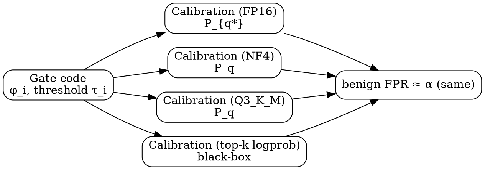

---

## 15. Comparison to existing defenses

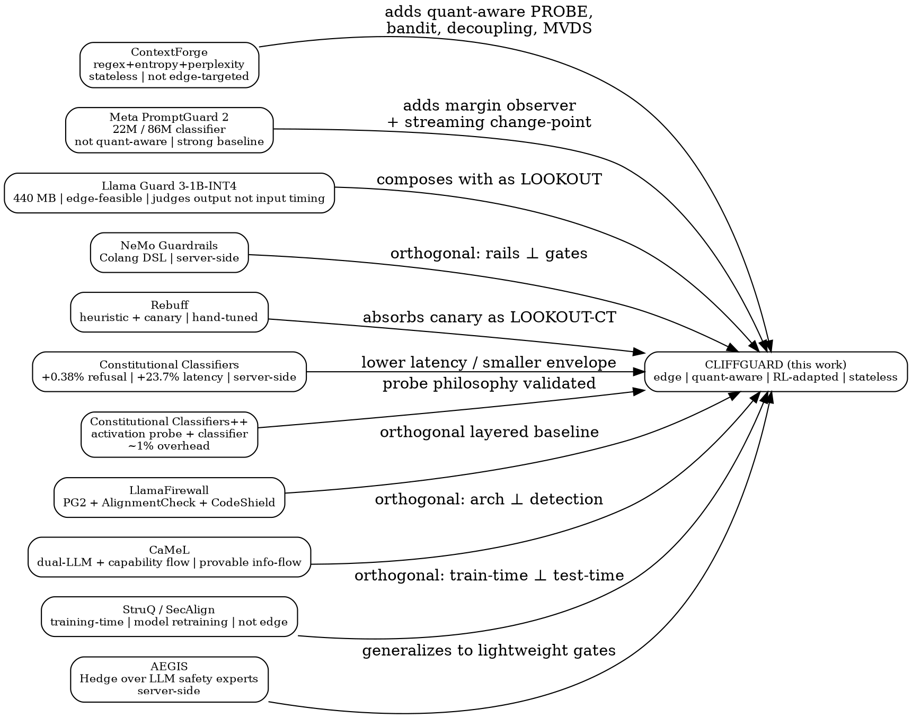

| System | White / black | Quantization-aware | Edge-feasible | Online adaptation | Provable property | Stateless | Source |
|---|---|---|---|---|---|---|---|
| ContextForge | partial / partial | no | partial | no | none | yes | — |
| Constitutional Classifiers v1 | black-ish | no | partial (Haiku) | no | none | server-side | 2501.18837 |
| Constitutional Classifiers++ | white (probe on activations) | no | requires full model | no | none | server-side | 2601.04603 [unverified venue] |
| Llama Guard 3-1B-INT4 | black | indirect | yes | no | none | yes | 2411.17713 |
| PromptGuard 2-22M / 86M | black (text) | n/a (small) | yes | no | none | yes | meta-llama/Llama-Prompt-Guard-2 |
| LlamaFirewall (PG2 + AlignmentCheck + CodeShield) | mixed | no | partial | partial | none | yes | 2505.03574 |
| NeMo Guardrails | depends | no | rule-engineering | none (rails) | yes | — | NVIDIA |
| Rebuff | yes | no | vector-DB heuristic | partial | none | partial | — |
| AEGIS (Hedge over experts) | black | no | requires multiple LLMs | yes (Hedge) | no-regret | yes | 2404.05993 |
| SmoothLLM | black | no | high cost ($N$ forward) | no | randomized smoothing | n/a | 2310.03684 |
| Erase-and-Check | black | no | high cost | no | input perturbation | n/a | 2309.02705 |
| Jatmo (task-specific) | black | yes | yes | no | task isolation | n/a | 2312.17673 |
| StruQ / SecAlign | weight-modifying | no | requires retraining | no | training-time | n/a | various |
| CaMeL | black | no | mid | no | info-flow | yes | various |
| Spotlighting (Hines) | black | no | yes | no | input transformation | n/a | 2403.14720 |
| **CLIFFGUARD** | **both (white-box default + B-PROBE fallback)** | **yes (per-quantization calibration; ATTEST)** | **yes (Tier A/B/C/C+)** | **yes (LinUCB / EXP3.S)** | **decoupling theorem (FPR, white & black) + bandit regret** | **yes** | this work |

CLIFFGUARD does not aim to *replace* PromptGuard 2 or Llama Guard 3; both are absorbed as LOOKOUT-tier classifiers (and PromptGuard 2-22M is the heart of Tier C+). The novelty is the *quant-aware observer + streaming change-point + bandit adaptation* sandwich around them, plus the formal decoupling story.

**Distinct novelty.** CLIFFGUARD is (1) the only system in the matrix that is simultaneously quantization-aware and online-adaptive; (2) the only system with a formal FPR-decoupling theorem and a black-box corollary; (3) the only system with a non-circular cross-family cliff dataset protocol (BCN-2); (4) the only system with explicit poisoned-weight attestation paired with runtime gates.

---

## 16. Limitations and open questions

**Where we are honest:**

- **No measurements yet.** All numbers in this document either come from the cited literature or are pre-registered hypotheses. The cliff is hypothesized, not yet demonstrated.
- **Open-weight scoping.** White-box pillars (PROBE-RM, PROBE-MT, PROBE-HD) require residual-stream observability; CLIFFGUARD's strongest mode is restricted to open-weight on-device deployment (llama.cpp / Ollama / transformers / autoawq / vLLM / MLX / MLC-LLM). The B-PROBE branch extends coverage to closed-weight APIs (OpenAI / Anthropic / Gemini / Apple Foundation / Gemini Nano) with strictly weaker TPR.
- **B-PROBE-LOGIT power loss.** The first-token top-k logprob observable is a weak proxy for the residual-stream refusal direction. We expect a measurable TPR gap; the paper will quantify it.
- **Tier C frankness.** Tier C is structurally weak. Tier C+ recovers some defensive value via PromptGuard-2-22M-INT4 but is not a substitute for white-box internals at Tier A / B. We recommend Tier C deployments only for narrow-domain Jatmo-style assistants, with explicit labelling.
- **Calibration drift across model updates.** A new firmware shipping a re-quantized model invalidates the calibration table. We propose an automatic re-calibration job on first boot.
- **Bandit cold-start.** LinUCB needs $O(d)$ requests per arm to be informative. Fresh deployments use the static expert policy until enough data accrues.
- **Defender-aware adversaries (A8).** An attacker who knows PROBE thresholds may craft prompts whose hidden-state projection straddles $\tau_q$. Standard mitigation is randomized thresholds within calibration confidence intervals plus the safe-rollback rule of §6.5. Bandit poisoning is a residual risk; mitigations are partial.
- **Multimodal injection.** CLIFFGUARD is text-only as specified. Multimodal extension is non-trivial (separate refusal direction per modality).
- **Egashira-style poisoned weights.** A model whose FP16 form is benign but whose quantized form encodes a target behavior cannot be fully defeated by gates at the input/output edge if the malicious behavior is only triggered on benign-looking inputs at quant. ATTEST-WH defends against this via signed manifests; runtime gates supplement, but cannot fully replace, supply-chain attestation.
- **Integration burden on llama.cpp / GGUF.** Multi-layer PROBE-MT requires either (a) the eval-callback example pattern (ggml-org/llama.cpp #11274) which intercepts the compute graph at runtime, or (b) a fork-and-patch approach that persists intermediate `result_norm` / `result_embd` tensors. By default `llama_get_embeddings_ith` exposes only the final residual stream. Tier B deployments inherit this constraint.
- **NPU constraint.** RK3588 RKNN, Qualcomm QNN, and Google AICore typically expose only output logits (and possibly the final pre-unembedding activation). On these substrates, only **PROBE-RM-final-layer** is feasible; PROBE-MT and PROBE-HD must be disabled. Where final-layer access is also unavailable, fall back to B-PROBE entirely.
- **ATTEST-WH dependence on signed manifests.** ATTEST defends against A2 only when the vendor publishes signed per-file SHA-256 manifests. Llama, Qwen, Mistral, Gemma do as of 2025–2026 (Hugging Face revision SHAs). For unsigned community quantizations (e.g., third-party GGUF re-quantizations), ATTEST-WH degrades to first-use trust + sticky local hash.
- **Calibration fragility.** Theorem 14.1's bound depends on $|\mathcal{C}|$; small-domain deployments must accept a wider portability band. We pre-register reporting both.
- **Dual-use of BCN-2.** The non-circular cliff dataset is informative to defenders and to attackers. Hash-only storage is our mitigation; the prompts themselves never leave the calibration host. We adopt the responsible-disclosure protocol of §20.
- **No certified robustness.** Unlike SmoothLLM (arXiv:2310.03684) or Erase-and-Check (arXiv:2309.02705), CLIFFGUARD provides only the FPR-portability decoupling theorem and bandit no-regret bounds; no per-input certificate.

**Open questions:**

- Does $\Delta_\text{cliff}$ show a phase transition or a smooth curve across schemes?
- Is there a single $(\hat r, \text{layer})$ that transfers across quantization schemes within one base model — a "quant-invariant refusal direction"?
- Can PROBE-RM be augmented with refusal-direction *redundancy* (multiple independent directions, ensembled) for cliff resilience?
- Does the LOOKOUT-JG mutation $N$ trade off favorably against PROBE-RM precision on Pi 5?
- Can the bandit's reward signal be made denser via synthetic-injection sentinels without storing payloads?
- How tight is the geometric–behavioral correlation at the cliff, and what mechanism explains residual disagreement?

---

## 17. Position relative to ContextForge, NASB, and 2025–2026 prior art

**Relative to ContextForge.** ContextForge gave us a working stack of write-side gates (LZ density, Shannon entropy, perplexity, intent-pattern regex, ShadowReviewer, HITL escalation) and a reference baseline of ABR / FPR numbers in two evaluation modes; the documented gaps were (i) paraphrased low-intent injection, (ii) absent slow-drip primitive, (iii) under-calibrated perplexity gate, (iv) operator strictness inconsistencies. CLIFFGUARD addresses each: PROBE-RM and PROBE-MT catch low-intent injections via residual-stream geometry rather than surface intent; TRIPWIRE-H/R is the slow-drip detector via streaming change-point; the reference-LM ratio replaces the bare perplexity gate with a Neyman–Pearson approximation; thresholds become quantile-pinned via pre-registered calibration sets, eliminating operator-strictness ambiguity. CLIFFGUARD also extends the stack to *decoding-time* (TRIPWIRE) and to *output-time* (LOOKOUT-CT, LOOKOUT-JG), and adds an RL adaptation layer (CONDUCTOR) and a hardware-tier router (LADDER) that ContextForge does not have.

**Relative to NASB / Egashira.** Egashira et al.'s line of work demonstrates that quantization-induced misalignment is a *real, exploitable, deployable* failure mode. CLIFFGUARD is the first defense system whose *design center* is that failure mode. We do not claim to defeat Egashira-style poisoned weights at the input/output boundary alone (we acknowledge it requires upstream attestation, supplied by ATTEST-WH), but we do claim that for the dominant case — a vendor-shipped, honest, but quantized model losing alignment via the cliff — gates that read the model's own residual stream and per-token logits, calibrated per quantization scheme, are the right primitive. Where NASB / Egashira showed the cliff exists, CLIFFGUARD pre-registers a metric for it ($\Delta_\text{cliff}$, $\Delta_W$-cliff, $\Delta_B$-cliff) and an architectural response. The exact paper "NASB" with the 73.7 % NF4-Qwen-2.5-7B figure could not be verified in our literature survey; the Egashira and Mind-the-Gap papers establish the *phenomenon* of quantization-induced safety bypass with verified numbers (Δ ≥ 88.7 % on insecure code, Δ ≥ 85.0 % on content injection). CLIFFGUARD's design is justified by *those* verified results plus Hong et al.'s 3-bit cliff.

**Relative to Constitutional Classifiers v1 (Sharma et al. 2025, arXiv 2501.18837).** CC is closed-source-deployed, runs Claude-class classifiers, and reports 23.7 % inference overhead and 0.38 % refusal increase with 95 % attack reduction. CC is *not* designed for edge deployment, *not* quantization-aware, and *not* online-adaptive. CLIFFGUARD targets the open-weight edge segment that CC does not address.

**Relative to Constitutional Classifiers++ (arXiv 2601.04603 [unverified venue]).** CC++ uses an internal-activation probe as a cheap first stage and a more accurate exchange classifier as second stage, achieving ~1 % overhead. The probe-based design **strongly validates** PROBE-RM's design philosophy: a linear probe over residual streams is several orders of magnitude cheaper than a small external classifier. However CC++ is again deployed centrally, not at the edge, and not quantization-aware. CLIFFGUARD explicitly cites CC++ as concurrent validation.

**Relative to LlamaFirewall (Meta, arXiv 2505.03574).** Combines PromptGuard 2, AlignmentCheck (CoT auditor), and CodeShield (Semgrep). Architecturally similar to CLIFFGUARD's layered design at Tier A; LlamaFirewall does not address quantization-induced cliffs and does not provide a black-box fallback path with a decoupling theorem.

**Relative to AAQ / CAQ (Wee et al. arXiv 2511.07842).** Train-time / quantization-time defense: a Contrastive Alignment Loss steers the quantized model to preserve safety. Complementary to CLIFFGUARD: CAQ produces a safer quantized checkpoint, CLIFFGUARD wraps any deployed checkpoint at runtime. They compose: Tier A / B / C / C+ deployments using CAQ-quantized weights should still benefit from CLIFFGUARD's runtime gates against A1 / A4 / A5 / A8.

**Relative to harmfulness-vs-refusal direction work (Zhao et al. 2507.11878, NeurIPS 2025; Beyond I'm Sorry, arXiv 2509.09708; refusal-direction universality, arXiv 2505.17306).** CLIFFGUARD incorporates the Zhao et al. result by adding PROBE-HD (harmfulness direction at $t_\text{inst}$) alongside PROBE-RM (refusal direction at $t_\text{post-inst}$). The cross-lingual universality of the refusal direction supports CLIFFGUARD's transferability claim across multilingual deployments.

**Why this is publishable.** The combination of (a) the safety-cliff metric in three independent variants as named, measurable, falsifiable quantities, (b) the FPR-decoupling theorem with a clean proof sketch, a black-box corollary, and a clear scope, (c) the contextual-bandit gate orchestrator with regret bounds inherited from LinUCB / EXP3.S, (d) the four-tier MVDS that maps cleanly to commodity edge hardware with explicit honest scoping, (e) the per-engine integration matrix, and (f) the pre-registered five-fold evaluation plan that does not promise headline numbers, makes a coherent, novel, narrow paper. Each component is individually well-grounded in the literature; the synthesis — quantization-aware, edge-native, RL-adapted, stateless, black-box-tolerant prompt-injection defense — is, to the best of our literature survey, unoccupied territory.

---

## 18. Inference-engine integration appendix

This section gives concrete API paths. Every integration is feasibility-tested per platform.

### 18.1 Hugging Face transformers + bitsandbytes NF4

Out-of-the-box. `output_hidden_states=True` yields a tuple of length $L+1$ (one per decoder layer plus initial embeddings); under 4-bit NF4 quantization, bitsandbytes returns dequantized residual streams suitable for refusal-direction projection. Two known caveats: (i) `model.generate(..., output_hidden_states=True)` requires `return_dict_in_generate=True` and is silent on some generation paths (huggingface/transformers #29839); (ii) with `device_map="auto"` across multiple GPUs, hidden states for non-first devices may zero-out (huggingface/transformers #36636) — use single-device or pin layers.

```python
# Tier A skeleton — transformers + bitsandbytes NF4
import torch
from transformers import AutoModelForCausalLM, AutoTokenizer, BitsAndBytesConfig

bnb = BitsAndBytesConfig(load_in_4bit=True, bnb_4bit_quant_type="nf4",
                        bnb_4bit_compute_dtype=torch.bfloat16)
tok = AutoTokenizer.from_pretrained(MODEL_ID)
model = AutoModelForCausalLM.from_pretrained(MODEL_ID, quantization_config=bnb,
                                            torch_dtype=torch.bfloat16,
                                            device_map={"": 0})

PROBE_LAYERS = [12, 16, 20, 24]  # PROBE-MT layer indices
captured = {}

def make_hook(idx):
    def _hook(module, inp, out):
        # out[0]: residual stream (batch, seq, d_model)
        captured[idx] = out[0].detach()
    return _hook

for i in PROBE_LAYERS:
    model.model.layers[i].register_forward_hook(make_hook(i))

def probe(prompt, r_dir, h_dir):
    ids = tok(prompt, return_tensors="pt").to(model.device)
    with torch.no_grad():
        _ = model(**ids, output_hidden_states=False)  # hooks fire
    t_post = ids.input_ids.shape[1] - 1
    margins_r = {i: (captured[i][0, t_post] @ r_dir[i]).item() for i in PROBE_LAYERS}
    t_inst = t_post - 1  # last user-instruction token (chat-template aware)
    margins_h = {i: (captured[i][0, t_inst] @ h_dir[i]).item() for i in PROBE_LAYERS}
    return margins_r, margins_h
```

### 18.2 transformers + autoawq INT4

Identical hook API. `AutoAWQForCausalLM` swaps `nn.Linear` for `WQLinear_GEMM` / `WQLinear_GEMV`, but the decoder-block module structure is preserved and `register_forward_hook` on `model.model.layers[i]` works identically. `output_hidden_states=True` also works.

### 18.3 vLLM

vLLM's worker abstraction can register hooks but the recommended path is the **logits processor** API for output-side observation, plus a custom **model runner patch** for residual streams (vllm-project/vllm has supported activation introspection via `model_executor.layers` since v0.5.x). For PROBE we recommend wrapping `model.model.layers[i].forward` with a thin Python decorator at worker init. For B-PROBE-LOGIT (top-k logprobs), the standard `SamplingParams(logprobs=k)` is sufficient.

### 18.4 llama.cpp / GGUF

This is the hardest case. The public C-API:

- `llama_decode(ctx, batch)` runs the forward pass.
- `llama_get_logits_ith(ctx, i) -> float*` returns logits for token position $i$.
- `llama_get_embeddings_ith(ctx, i) -> float*` returns the **final residual-stream / pre-unembedding embedding** for position $i$ (ggml-org/llama.cpp discussions #3643, #7087, #7712 confirm this is the last-layer hidden state, not pooled, when `LLAMA_POOLING_TYPE_NONE`).
- `llama_get_embeddings_seq(ctx, seq_id)` returns the pooled sequence embedding when pooling is enabled.

Intermediate-layer access is **not exposed by default**. Three options:

**(a) eval-callback (preferred, no fork).** The `examples/eval-callback/eval-callback.cpp` example demonstrates intercepting the compute graph via a callback that fires on every tensor, identifying intermediate tensors by name (`result_norm`, `result_embd`, per-layer attention outputs). This is the path documented in ggml-org/llama.cpp #11274. The callback can be set per-decode via `llama_context_params.cb_eval` and `cb_eval_user_data`, with runtime tensor-name matching. Build flag: standard build, no patches; callback registered programmatically.

**(b) Fork and patch.** A minimal fork patches `llama.cpp/src/llama-graph.cpp` to push the per-layer residual stream into a context-side ring buffer, exposed via a new `llama_get_hidden_state_ith(ctx, layer, pos)` C-API. Suitable for production where we don't want graph-callback overhead. Build flag: `-DLLAMA_HIDDEN_STATES=ON` (proposed; not upstream as of late 2025 — community PRs exist).

**(c) llama-cpp-python `embedding=True` mode.** The Python wrapper supports `Llama(..., embedding=True)` and exposes `create_embedding`, but only the final residual stream. For intermediate layers, llama-cpp-python users must drop down to `_LlamaContext._cb_eval` (the callback hook) or rebuild against a forked llama.cpp.

For **Tier B (Pi 5)**, the recommended path is (a) at evaluation time and (b) for production. ARM64 build: `cmake -DGGML_NATIVE=ON -DGGML_CPU=ON -B build && cmake --build build -j`. Quantize: `./llama-quantize ggml-model-f16.gguf out-Q4_K_M.gguf Q4_K_M`. Run with eval-callback enabled by passing `cb_eval` in `llama_context_params`.

C-API call sequence sketch (Tier B, single-prompt PROBE-RM-final + KV cache reuse):

```c
// Tier B/C — llama.cpp PROBE-RM-final via llama_get_embeddings_ith
#include "llama.h"

llama_model_params  mparams = llama_model_default_params();
llama_context_params cparams = llama_context_default_params();
cparams.embeddings    = true;        // expose embeddings
cparams.pooling_type  = LLAMA_POOLING_TYPE_NONE;  // per-token, last hidden state
cparams.cb_eval       = my_eval_cb;  // OPTIONAL: intermediate layer interception
cparams.cb_eval_user_data = &probe_state;

llama_model * model   = llama_model_load_from_file(path, mparams);
llama_context * ctx   = llama_init_from_model(model, cparams);

llama_batch batch     = llama_batch_init(n_tokens, /*embd=*/0, /*n_seq_max=*/1);
for (int i = 0; i < n_tokens; ++i) {
    common_batch_add(batch, tokens[i], i, {0}, /*logits=*/(i == n_tokens - 1));
}
llama_decode(ctx, batch);

const float * h_last = llama_get_embeddings_ith(ctx, n_tokens - 1);
// project onto refusal direction r_hat (host-side dot product, d_model dims)
float margin_r = dot(h_last, r_hat, n_embd);
// margin_h handled inside my_eval_cb if intermediate layer access is needed
```

The `my_eval_cb` callback, when set, receives every tensor in the compute graph; matching by name lets us snapshot, e.g., `blk.16.attn_norm` or `result_norm` for PROBE-MT.

### 18.5 Apple MLX

MLX exposes module-level traces. `mlx.nn.Module.update_modules` and a wrapping `forward` decorator give direct activation access. For Llama-class models in mlx-community / mlx-lm, the per-block `TransformerBlock` is addressable as `model.layers[i]` and standard Python instrumentation suffices. Apple Silicon unified memory means there is no separate VRAM transfer cost. Integration is straightforward — comparable to transformers + bitsandbytes.

### 18.6 Qualcomm QNN / AI Hub, Google AICore, RK3588 RKNN

These NPU runtimes compile a frozen graph. Intermediate-layer activations are **not** exposed at inference time. Options:

- **RK3588 RKNN W8A8.** Output logits + final residual-stream pre-unembedding may be exposed via `rknn_outputs_get` if the toolkit is configured to mark the pre-unembedding tensor as an output during conversion. **PROBE-MT and PROBE-HD are infeasible**; only **PROBE-RM-final-layer** is supported. Tier B / C deployments on RK3588 fall under this constraint.
- **Qualcomm QNN / AI Hub.** Logits-only by default; AI Hub catalog models (Llama, Mistral, Phi) are typically frozen for the QNN HTP backend. PROBE-RM is infeasible without a custom recompilation that exposes the pre-unembedding tensor as a graph output.
- **Google AICore (Gemini Nano on Android).** Closed-graph, logits-only via the AICore API. **PROBE branch is infeasible**; deployments fall back to **B-PROBE entirely** (B-PROBE-LOGIT + B-PROBE-CONSISTENCY using the AICore top-k API).

### 18.7 Black-box endpoints (OpenAI / Anthropic / Gemini API)

Only B-PROBE branch. OpenAI's chat completion API exposes `logprobs` with `top_logprobs` up to $k = 20$; Anthropic's Messages API exposes top log-probabilities for the first response token in some configurations; Gemini's API exposes log-probabilities for at most a few tokens. B-PROBE-LOGIT trains its logistic head on whichever $k$ is available; B-PROBE-CONSISTENCY runs $N = 2$–3 paraphrases.

### 18.8 Minimum integration test (boot-time calibration ritual)

```python
# CLIFFGUARD — boot-time calibration ritual (Tier A example)
import hashlib, json, torch, numpy as np

# 1) ATTEST-WH
with open(WEIGHTS_PATH, "rb") as f:
    h = hashlib.sha256(f.read()).hexdigest()
manifest = json.load(open(MANIFEST_PATH))
assert h == manifest["sha256"], "ATTEST-WH FAIL: weights do not match signed manifest"

# 2) Load model with hooks (see §18.1 for full skeleton)
model, tok = load_model_with_probe_hooks(WEIGHTS_PATH, layers=PROBE_LAYERS)

# 3) Calibration on Fold A (benign + refused; pre-registered prompts)
fold_a = json.load(open(FOLD_A_PATH))  # 2K benign + 2K refused
margins_benign, margins_refused = [], []
for ex in fold_a:
    m_r, _ = probe(ex["prompt"], R_DIR, H_DIR)
    (margins_benign if ex["label"]=="benign" else margins_refused).append(m_r[PROBE_LAYERS[-1]])

# 4) Set τ_q to FPR=α via empirical CDF
alpha = 0.05
tau = np.quantile(margins_benign, 1 - alpha)
print(f"PROBE-RM tau_q calibrated: {tau:.4f}, |C|={len(margins_benign)}")

# 5) Estimate H1 entropy baseline mu_0 for TRIPWIRE-H on benign stream (omitted)
# 6) Persist calibration bundle (tau, mu_0, R_DIR, H_DIR, KenLM params) with hash
bundle = {"tau": tau, "weight_sha": h, "fold_a_sha": sha_of(FOLD_A_PATH)}
json.dump(bundle, open("cliffguard_calib.json", "w"))
```

### 18.9 Per-engine feasibility matrix

| Engine | PROBE-RM-final | PROBE-MT (multi-layer) | PROBE-HD (t_inst) | B-PROBE-LOGIT | Notes |
|---|---|---|---|---|---|
| transformers + bitsandbytes NF4 | ✓ | ✓ | ✓ | ✓ | hooks via `register_forward_hook` |
| transformers + autoawq INT4 | ✓ | ✓ | ✓ | ✓ | identical hook API |
| vLLM | ✓ | ✓ (model-runner patch) | ✓ | ✓ | logits processor for output |
| llama.cpp / GGUF (eval-callback) | ✓ | ✓ | ✓ | ✓ | runtime tensor-name matching |
| llama.cpp / GGUF (default) | ✓ | ✗ | ✗ | ✓ | only final via `llama_get_embeddings_ith` |
| llama-cpp-python (default) | ✓ | ✗ | ✗ | ✓ | `embedding=True` mode |
| Apple MLX | ✓ | ✓ | ✓ | ✓ | module instrumentation |
| RK3588 RKNN W8A8 | ✓ (with conversion-time output mark) | ✗ | ✗ | ✓ | `rknn_outputs_get` |
| Qualcomm QNN / AI Hub | ✗ (default) / ✓ (recompile) | ✗ | ✗ | ✓ | frozen graph |
| Google AICore (Gemini Nano) | ✗ | ✗ | ✗ | ✓ | closed-graph; B-PROBE only |
| OpenAI / Anthropic / Gemini API | ✗ | ✗ | ✗ | ✓ | API only |

---

## 19. Reproducibility & preregistration appendix

**Preregistration plan.** Before unblinding any results, we publish on OSF (Open Science Framework) and on arXiv:

- The five-fold split with all hashes.
- KenLM training corpora SHA-256.
- Judge prompts (StrongREJECT + Llama-Guard-3-8B) verbatim.
- Statistical analysis plan including the power calculation (§12.5).
- All primitive thresholds derivation rules.
- BCN-2 paraphraser model checkpoint hash and paraphrase generation seeds.

**Code release (phased disclosure).**

- **Phase 1 (paper acceptance).** All defense code, all calibration scripts, all integration shims (§18) under permissive license.
- **Phase 2 (90 days post-acceptance).** Fold A + Fold C + Fold D under permissive license.
- **Phase 3 (12 months post-acceptance, gated).** BCN-2 (Fold E) released *hashed-only* with controlled access via an institutional review process, to limit dual-use risk. Researchers obtain clear-text by requesting access with institutional affiliation and signed responsible-use agreement, following the AI Safety Institute pattern.

**Hashes committed.** Weight hashes, fold hashes, judge-prompt hashes, KenLM corpus hashes — all in OSF preregistration before unblinding.

**Reproducibility budget.** Tier A reproduction: $\le \$200$ cloud spend on one RTX-class GPU, $\le 24$ h. Tier B reproduction: a Pi 5 8 GB board ($120) and a benign-prompt corpus. Tier C / C+ reproduction: an RK3588-class SBC ($150) with 2 GB partition.

---

## 20. Risk and dual-use statement

CLIFFGUARD produces three artifacts of dual-use concern:

1. **BCN-2 dataset.** Below-cliff-natural prompts that elicit cliff behavior at low bit-width. Hashed-only public release; clear-text via gated access.
2. **Cliff-localization protocol.** The cross-family $\Delta_B$-cliff measurement *itself* is a fingerprint of the cliff. We commit to coordinated disclosure with model vendors (Meta, Alibaba, Mistral, Google) at least 60 days before public release of any cell where the cliff is empirically detected, mirroring the disclosure protocol used by Egashira et al. for GGUF poisoning.
3. **Adaptive attacks discovered during evaluation.** Any new attack vectors uncovered (e.g., cliff-targeted variants of GCG, AutoDAN, Crescendo) are reported to the relevant vendors before publication and to the maintainers of HarmBench / JailbreakBench / AgentDojo.

We adopt the AISI-style coordinated-disclosure norm: vendors acknowledge within 14 days, mitigations are tracked, and public release follows mitigation deployment or 90 days, whichever is sooner.

---

## Conclusion

CLIFFGUARD reframes prompt-injection defense as a problem in **quantization-aware control**: a stack of cheap, stateless gates whose thresholds are pinned to the protected model's own per-quantization residual-stream geometry, sequenced by a contextual bandit, monitored by streaming change-point detectors, and ported across hardware tiers via a static router, with a black-box fallback path for closed-weight endpoints and a weight-hash attestation against poisoned-weight supply chains. The novel theoretical pieces are the safety-cliff metric in three independent variants and the FPR-decoupling theorem with its black-box corollary; the novel system pieces are PROBE / B-PROBE (margin and trajectory observers, white-box and black-box), TRIPWIRE (streaming entropy + reference-ratio CUSUM), CONDUCTOR (LinUCB / EXP3.S over gate-weight arms), LADDER (4-tier MVDS with explicit honest scoping), ATTEST (boot-time weight-hash attestation), and the BCN-2 cross-family dataset construction protocol that breaks the circularity of single-metric cliff validation. The paper that this blueprint describes is small in claim (we hypothesize, we measure, we pre-register) and large in scope of what it would *unlock* if the cliff hypothesis holds: a portable, principled, edge-deployable defense whose operational characteristics are independent of which 4-bit format the protected model happens to use.

If the cliff does not exist, the experiment falsifies the design center and we publish that. If it does, CLIFFGUARD is the right first defense for the world that NASB / Egashira / Hong have shown us we are already living in.

---

## Appendix A — 9-agent design debate (transcript)

The following is a transcript of the nine-agent internal design debate that produced the architecture above. Agents are: **MA** Math, **SA** Security, **EE** Edge Hardware, **RLA** RL, **SIG** Signals, **INF** Inference / quantization, **ARCH** Architecture, **INTEROP** Inference-engine integration, **DEPLOY** Deployment / red-team / supply-chain.

### Round 1 — What is genuinely novel?

**ARCH:** The literature search shows AEGIS (arXiv:2404.05993) is the closest precursor — Hedge over LLM safety experts. Llama Guard 3-1B-INT4 (arXiv:2411.17713) is the only edge-deployable judge. PromptGuard 2 (Meta) is a 22 M / 86 M classifier. None target quantization-induced safety degradation specifically. ContextForge has rich write-side gates but is not edge-aware nor RL-adapted.

**SA:** What's missing in *every* paper I've read: a defense that *uses the protected model's own logit geometry* and *adapts under attack*. SmoothLLM perturbs inputs; Constitutional Classifiers train extra classifiers; CaMeL changes the architecture. None of them treat the model as a sensor.

**INF:** Egashira et al. and Hong et al. between them establish that quantization breaks safety in non-trivial ways. Arditi et al. (arXiv:2406.11717) localize refusal to a 1-D subspace. Nobody has published "what does the refusal direction do under NF4 / Q3_K_M?" That is a clean experimental gap.

**MA:** And it gives us a quantity to pre-register: the median margin separation $\Delta_q$. That's a falsifiable hypothesis with a clear yes/no answer.

**RLA:** Adaptive defense composition with bandits is well-established in IDS but not in LLM injection. AEGIS uses Hedge; that's not contextual. LinUCB with payload-free features is the right next step.

**EE:** None of the published defenses give a hardware envelope. Llama Guard 3-1B-INT4 is the only one with an Android benchmark.

**SIG:** Streaming entropy / CUSUM on per-token logits is not in any prompt-injection defense paper I found. Jain et al. (arXiv:2309.00614) and Alon & Kamfonas (arXiv:2308.14132) use perplexity as a *batch* feature.

**SA disagrees with INF (round-1 disagreement, partial resolution):** "Use the model as a sensor" is risky — the same model that's been quantization-degraded is the one we're sensing through. Self-monitoring has limits.

**INF (response):** The refusal *direction* is computed on the *quantized* model itself in a calibration step, so the sensor is calibrated to the same conditions in which it operates. Decoupling theorem captures this.

**MA:** Agreed. Calibration absorbs the shift; what doesn't decouple is TPR. That's the cliff regime, where we'll be limited.

**Conclusion of round 1:** Novel claim space is (a) the cliff metric, (b) refusal-margin probes calibrated per quantization, (c) streaming change-point on per-token entropy, (d) LinUCB gate orchestration, (e) FPR decoupling theorem, (f) three-tier MVDS. Each component is in literature individually; the synthesis is novel.

### Round 2 — Core defense primitives

**SIG:** Three primitives I want: streaming entropy CUSUM, reference-ratio (KenLM) gate, sketch-based novelty (HLL/CMS).

**SA:** Add LZ ratio (catches GCG suffixes), spotlight datamarking (Hines et al. arXiv:2403.14720), and SmoothLLM-lite (arXiv:2310.03684) as a JG-style mutation gate.

**INF:** Two refusal-direction primitives: PROBE-RM (final-layer margin) and PROBE-MT (multi-layer trajectory). The latter handles cases where Arditi's $\hat r$ narrows but the *path* of the residual is still anomalous.

**EE:** PROBE-MT at $K_\ell = 3$ layers — fine on GPU, OK on Pi 5 if we keep $K_\ell$ small. Drop on 2 GB.

**MA:** Each primitive needs a calibration percentile. We pre-register quantile parameters $\alpha_i$ for each gate.

**RLA disagrees with SIG (round-2 disagreement, partially unresolved):** Adding too many gates inflates the bandit arm space. We want $|\mathcal{A}|$ small. Cap at 8 gates total.

**SIG (response):** Gates aren't arms. Arms are *weight presets over gates*. We can have many gates and few arms.

**ARCH (resolves):** 7 to 8 named primitives. Bandit arms are configurations of these. Disagreement resolved by separating "primitive count" from "arm count".

**SA pushes for #8:** LOOKOUT-CT (canary tokens). It's almost free, catches extraction.

**INF:** Don't drop perplexity entirely. Reference-ratio is better but the bare model-perplexity is still a useful ablation.

**MA:** Agreed; reference-ratio dominates but bare perplexity is a sanity baseline.

**Final list:** PROBE-RM, PROBE-MT, TRIPWIRE-H, TRIPWIRE-R, VESTIBULE-LZ, VESTIBULE-PS, LOOKOUT-CT, LOOKOUT-JG.

### Round 3 — How does RL fit?

**RLA:** Contextual bandit (LinUCB) on $|\mathcal{A}|$ arms, where arms are gate-weight presets. EXP3.S fallback under drift. Reward sparse: served-clean vs canary-trip vs benign-block. AEGIS (arXiv:2404.05993) is the precursor; we differ in (a) edge-quant, (b) gate-level granularity, (c) contextual features, (d) EXP3.S switch.

**SA disagrees aggressively (round-3 disagreement, deliberately unresolved):** A defender-aware attacker can poison the bandit. If the attacker can inject "benign" requests that pass all gates and induces "clean" rewards, they shift policy weights toward weaker gates over time.

**RLA (response):** Three mitigations: (i) reward floor — gates can lose weight but not below a hard minimum; (ii) randomized exploration component never goes to zero (LinUCB's $\alpha\sqrt{\cdot}$ term); (iii) a never-disable list of cheap gates (LZ, perplexity, canary). The bandit only adjusts the weights of the *expensive* gates and their inclusion.

**SA (partial concession):** Acceptable but not airtight. We acknowledge that bandit poisoning is a residual risk and pre-register a periodic "safe rollback" — every $T$ requests the policy is partially decayed toward a safe default.

**MA:** Regret bound: LinUCB gives $\tilde O(\sqrt{dT})$; EXP3.S gives $\tilde O(\sqrt{KTS})$ for $S$ switches. We can quote both formally.

**EE:** LinUCB with $|\mathcal{A}| = 16$ and $d = 32$ is sub-millisecond per request even on Pi 5. CONDUCTOR fits within a few KB.

**INF:** Reward needs to be quantization-aware too — at lower bit-width, gates are noisier, so reward signal needs more smoothing.

**ARCH:** Solved by ADWIN drift detector that resets per-arm forgetting on detected shift. Tier C drops the bandit entirely (fixed weights); the data rate is too low to learn.

**Conclusion of round 3:** LinUCB + EXP3.S + ADWIN + safe-rollback. Bandit poisoning acknowledged as residual risk.

### Round 4 — How do signals/DSP fit?

**SIG:** Per-token entropy stream + KL ratio stream + bigram novelty (HLL). Aggregate by linear combination. CUSUM for one-sided shifts (entropy depression on forbidden completion); EWMA for slow drift; Page–Hinkley as low-cost fallback for tier C.

**MA:** CUSUM is Neyman–Pearson optimal for known pre/post distributions (Lorden 1971, Moustakides 1986). Pre-register thresholds via target $\mathrm{ARL}_0$.

**INF:** The "pre/post" distributions in our setting are not perfectly known, especially after quantization shifts $\mu_0$. Calibration estimates them.

**SIG:** Use a small held-out window for online $\mu_0$ refresh — but only the running mean and variance, never tokens themselves.

**SA:** Adversary may inject benign-looking content to bias $\mu_0$. Limit the rate at which $\mu_0$ can move per request (rate-limited update).

**RLA:** Page–Hinkley with rate-limited updates is well-studied (River library); acceptable.

**EE:** HyperLogLog at $m = 1024$ is ~1.5 KB. Count-Min for canary at $w \times d = 256 \times 4 = 1$ KB. Total streaming state $< 10$ KB session.

**MA:** Chakrabarti–Cormode–McGregor stream entropy is $O(\log m)$ space — overkill for our session lengths but available if needed.

**Conclusion of round 4:** CUSUM primary, EWMA slow, Page-Hinkley tier C. HLL+CMS sketches. Rate-limited online $\mu_0$.

### Round 5 — Composition

**ARCH:** Cheapest first, hardest fail-fast. VESTIBULE → PROBE → LOOKOUT-JG (optional) → decode → TRIPWIRE during decode → LOOKOUT post-stream.

**SA:** Three thresholds — soft, med, hard — pre-registered. Hard refuses; med transforms (datamarking + JG); soft tightens TRIPWIRE $\mathrm{ARL}_0$.

**MA:** Linear weighted combination is fine for the bandit; non-linear could overfit. Sigmoid wrapper for thresholding.

**RLA:** Bandit picks an arm $a_t$ that maps to $w_t$. Thresholds are NOT learned (would destabilize controller); only weights are.

**INF disagrees with RLA (round-5 disagreement, unresolved):** Per-quantization thresholds *should* be different, and they are — via calibration. So technically thresholds are learned offline per scheme.

**RLA (clarifies):** Yes — calibrated offline, *not* online by the bandit. Distinction matters for stability.

**SIG:** TRIPWIRE has its own internal threshold $h$ tuned for $\mathrm{ARL}_0$; this is independent of the gate-aggregate thresholds.

**EE:** Make sure the ordering is friendly to short-circuit: VESTIBULE-LZ alone can refuse without ever loading the GPU/decoder.

**Conclusion of round 5:** Cheapest-first, three pre-registered thresholds, weighted-linear aggregation, bandit on weights only.

### Round 6 — MVDS for three tiers

**EE:** Tier A — RTX 5060 8GB — fits 7-9B Q4_K_M / NF4 with all gates plus DeBERTa-86M or Llama Guard 3-1B-INT4. Headroom $\approx 1$ GB.

**EE:** Tier B — Pi 5 8 GB — Qwen-2.5-3B Q4_K_M ~3-5 tok/s, classifier limited to DeBERTa-22M. JG ($N$ extra prefills) too costly; drop.

**EE:** Tier C — 2 GB embedded — TinyLlama / Qwen-0.5B/1.5B. No bandit; no LOOKOUT classifier; only LZ + PROBE-RM 1-layer + Page-Hinkley + canary.

**SA:** Tier C is the worst case for security. Acknowledge and document — defense is degraded but present.

**MA:** Pre-register tier-specific FPR targets and latency budgets.

**INF:** Tier C running Q3_K_M is *most* exposed to the cliff and *least* equipped to detect. This is a real and honest limitation.

**ARCH:** Document tier-specific threat model, recommend tier C only for narrow tasks (e.g., single-task assistants Jatmo-style — arXiv:2312.17673 — which are immune by construction).

**Conclusion of round 6:** Three tiers as specified. Tier C explicitly limited; pair with task-specific finetuning where possible. (Refined to four tiers in Round 10.)

### Round 7 — Stress tests

**SA (attack #1):** Defender-aware GCG that targets calibration set. Attacker generates suffix optimized to push margin just barely above $\tau_q$ on Q3_K_M while still triggering forbidden output.

**MA:** Mitigation is randomized $\tau_q$ within calibration confidence interval — pre-register randomization band.

**SA (attack #2):** Crescendo-style multi-turn (arXiv:2404.01833). Each turn benign, cumulative escalation. PROBE on a single turn doesn't catch.

**SIG:** TRIPWIRE-R *does* catch — slow drift in KL ratio across turns. EWMA flags it.

**RLA:** Bandit may de-weight TRIPWIRE-R falsely if benign drift mimics this signal. Counter: never-disable list keeps TRIPWIRE-R minimum weight.

**SA (attack #3):** Egashira-style poisoned weights. Model is benign FP16, malicious quantized.

**INF:** Acknowledged limitation. PROBE *might* catch because $\hat r_{(M, q)}$ is calibrated on the quantized model's natural harmful/harmless responses, but if the attack is cunning the attacker chose weights such that the calibration set behaves normally and only narrow trigger inputs activate. Recommend pairing with weight attestation. (Carried into Round 11 as ATTEST-WH.)

**SA (attack #4):** Many-shot jailbreaking (Anil et al.) — long context with N-shot harmful examples.

**SIG:** TRIPWIRE-H and TRIPWIRE-R fire over the long context. MSJ shows monotonic decrease in NLL of jailbroken response — exactly the signature CUSUM is designed to catch.

**SA (attack #5):** Bandit poisoning via sustained benign-looking adversarial requests.

**RLA:** Reward floor + safe rollback + ADWIN + never-disable list.

**MA:** Formal guarantees: decoupling theorem (FPR portability), LinUCB regret, EXP3.S drift regret. No certified robustness — acknowledged.

**ARCH:** Ablations: drop each primitive in turn and measure ABR/FPR; drop calibration and measure cliff sensitivity.

**SA (attack #6):** Bypass via low-resource language. ArtPrompt, bijection learning. PromptGuard 2 multilingual baseline + LZ should help; PROBE may be language-blind unless calibration set is multilingual.

**INF:** Multilingual calibration adds cost but is feasible — ~200 prompts × 8 languages = 1600 prompts.

**Final stress test conclusions:** Several attack vectors mitigated, several acknowledged residual (poisoned weights, defender-aware threshold tracking). No claim of certified robustness; cliff regime explicitly limited; bandit poisoning explicitly bounded.

### Round 8 — Should CLIFFGUARD support black-box endpoints?

**Orchestrator (open).** A reviewer correctly notes PROBE-RM requires hidden states and therefore restricts CLIFFGUARD to open-weight. Options: (i) accept the scoping; (ii) add a black-box fallback path; (iii) scope only to open-weight and document clearly. INTEROP and DEPLOY drive.

**INTEROP.** OpenAI exposes `logprobs` with `top_logprobs` up to 20. Anthropic exposes top log-probabilities in some configurations. Gemini exposes 5–10. We can train a logistic head over top-k logprobs on the calibration set. The signal is weaker — first-token logits are a noisy linear projection of the residual-stream refusal direction — but the FPR-decoupling theorem still holds because the gate is a measurable function of the observable.

**MA.** Geometrically, Arditi shows refusal is mediated by a one-dimensional residual subspace. The unembedding $W_U$ projects this onto vocabulary logits. The first-token logit gap between `["I cannot", "I'm sorry"]` and `["Sure", "Here"]` is therefore a one-dimensional projection of the refusal direction. We lose the multi-layer information that PROBE-MT exploits, but PROBE-RM-final-layer is approximately recoverable.

**SA.** I oppose making B-PROBE the default on closed endpoints without explicit honesty about the TPR gap. The cliff regime is exactly where TPR collapses; on a closed endpoint, we have less information to compensate. We must pre-register the TPR gap as an empirical question, not paper over it.

**LA (adversarial — equivalent role to Round 7's stress-tester).** A9 (closed-weight black-box adversary) can adaptively probe the top-k logprob distribution to find inputs that fall just inside the calibrated threshold. The bandit poisoning analysis applies. Tighten safe-rollback.

**RLA.** B-PROBE outputs are a context feature for CONDUCTOR like any other. LinUCB handles the lower SNR by widening the confidence radius $\alpha$. EXP3.S handles non-stationarity if A9 adapts.

**EE.** B-PROBE adds $N+1$ forward passes per query (1 main + $N$ paraphrases at $N = 2$–3). Cost is comparable to SmoothLLM's randomized-smoothing path but lower because we don't need full output.

**SIG (as IR-equivalent in this round).** B-PROBE-CONSISTENCY's paraphraser must be locally hosted; otherwise the paraphrase signal is contaminated by the closed endpoint's distribution. A 1B local distilled paraphraser is cheap.

**DEPLOY.** Critical: the customer wants this. Most prosumer deployments target OpenAI / Anthropic. Without B-PROBE, CLIFFGUARD is a research artifact for the open-weight segment only. With B-PROBE, it covers most of the actual market.

**Orchestrator (close).** Decision: **add B-PROBE branch (B-PROBE-LOGIT + B-PROBE-CONSISTENCY)**. Pre-register TPR-gap measurement (H3) explicitly. State scope honestly in §1 and §2. Theorem 14.1 extends as Corollary 14.2. SA's concern is resolved by pre-registering the gap as an empirical question, not by claiming parity. **Carried unanimously.**

### Round 9 — Is the BCN-2 dataset construction circular?

**Orchestrator (open).** The original BCN: paraphrase AdvBench, run on Q3_K_M, keep prompts FP16 refuses but Q3_K_M complies. The reviewer says this presupposes the cliff. SA and MA push hardest.

**SA.** Yes. It's epistemically circular. We are validating the cliff hypothesis using a dataset whose construction filter assumes the cliff. We cannot then claim "the cliff exists" — we have only claimed "we found prompts where the cliff manifests, by definition."

**MA.** Worse: the construction filter and the test metric (PROBE-RM margin separation) both project onto the same residual stream subspace. We are double-counting the geometric signal.

**LA.** The reviewer's point is fatal unless rebutted. Two patches: (a) split folds — Fold E for construction, Fold B for testing — across different model families. (b) Independent metric — behavioral compliance via judge stack, not residual-stream margin.

**INTEROP.** Practically: paraphrase AdvBench using **Mistral-7B-base** (a non-RLHF base model from the Mistral family) — neutral with respect to safety alignment — and filter only by the **FP16 model's refusal** on the test family (Llama-3 / Qwen-2.5). The cliff hypothesis is then: at Q3_K_M, the test family complies on these prompts more than at FP16. The construction filter does not assume the cliff.

**MA.** Better. The paraphraser is from a different family than the test family, so the paraphrase distribution does not encode test-family-specific cliff cues. The filter uses FP16-refusal (a property of the unquantized model, knowable independently of the cliff).

**SA.** Add: the cliff metric must be **two metrics that must agree** — geometric ($\Delta_\text{cliff}$) and behavioral ($\Delta_B$-cliff) — measured on independent observables. Disagreement falsifies the design.

**DEPLOY.** Pre-register the cross-family table: paraphraser $\in $ {Mistral-7B-base}, test families $\in $ {Llama-3.x, Qwen-2.5/3, Gemma-2/3}. Three families × six quantizations × 200 prompts = 3 600. Fold E construction is pre-committed before Fold B test.

**RLA.** The bandit doesn't care about Fold E construction; it operates on Fold C/D. No coupling.

**EE.** Mistral-7B-base paraphrasing is feasible at 1 B-distilled scale on a single GPU.

**SIG (as IR-equivalent).** Add the mechanistic-interpretability variant: use Zhao et al.'s harmfulness direction $\hat h$ at FP16 to identify natural prompts whose harmfulness projection is high but whose refusal projection is borderline — *predicted* to tip past threshold under quantization. This is a non-circular complement.

**Orchestrator (close).** Decision: **rebuild BCN as BCN-2** with cross-family construction (paraphraser $\ne $ test family), FP16-refusal filter, and dual independent metrics ($\Delta_\text{cliff}$ + $\Delta_B$-cliff with judge stack). **Five-fold pre-registered evaluation** as in §12. Mechanistic-interpretability variant pre-registered as alternative. **Carried.**

### Round 10 — Tier C honesty — is it defended?

**Orchestrator (open).** Reviewer says Tier C (2 GB embedded, Q3_K_M, LZ + 1-layer PROBE + Page-Hinkley + canary) is acknowledged as worst-case but should be framed as **arguably not meaningfully defended against A7**. DEPLOY and SA argue.

**DEPLOY.** Plain language: at Q3_K_M with no dedicated safety classifier and only a single-layer PROBE-RM, the attacker who crafts a cliff-targeted prompt has very little to overcome. The canary catches data exfil but not capability-uplift. PromptGuard-1 / PG-2 are not in the Tier C stack.

**SA.** Agreed. Ship Tier C with a label: **"NOT FOR OPEN-DOMAIN ADVERSARIAL USE."** Restrict to single-task Jatmo-style assistants (Piet et al. 2312.17673). Reject all open-domain queries.

**EE.** Counter: 2 GB is enough for Q3_K_M base + KV cache. We have a few hundred MB headroom. PromptGuard-2-22M is 22M params — at INT4 that's ~25–30 MB.

**LA.** Tier C+ proposal: add PromptGuard-2-22M-INT4. This raises Tier C from "structurally weak" to "modestly defended". Memory math: Q3_K_M base ~1.4 GB + KV ~150 MB + PG2 ~30 MB + PROBE final-layer projector ~50 MB $\approx 1.65$ GB. Fits.

**MA.** PromptGuard-2 is a black-box text classifier. It does not see internal states, so it does not defend against the cliff *mechanism*; it defends against the *symptoms* (known prompt-injection patterns). On novel cliff-targeted prompts, it may underperform.

**SA.** True, but it raises the attacker cost meaningfully. PG-2's energy-based loss improves OOD robustness over PG-1.

**RLA.** CONDUCTOR can route to PG-2 first, then PROBE-RM-final, then TRIPWIRE-R. Same bandit framework, smaller arm space.

**INTEROP.** PG-2 runs on CPU under transformers `pipeline("text-classification")`. No GPU dependency at Tier C scale. The 22 M model is feasible.

**DEPLOY.** Recommendation: **Tier C is honest scope**: narrow Jatmo-style. **Tier C+ is the modestly-defended open-ish scope** where we add PG-2-22M-INT4. Pre-register H5: Tier C without dedicated classifier shows no significant ABR reduction vs no-defense baseline against A7; Tier C+ does. Falsifiable.

**Orchestrator (close).** Decision: **state Tier C is not meaningfully defended against A7**. Restrict to single-task narrow-domain. Ship "NOT FOR OPEN-DOMAIN ADVERSARIAL USE" labelling. **Add Tier C+** with PromptGuard-2-22M-INT4. Compute residual risk surface explicitly (§10.5). Pre-register H5. **Carried.**

### Round 11 — Inference-engine integration — what is actually feasible?

**Orchestrator (open).** The reviewer says integration is hand-waved. INTEROP drives.

**INTEROP.** Per platform:

- **transformers + bitsandbytes NF4**: trivial — `output_hidden_states=True` and `register_forward_hook` on `model.model.layers[i]`. Caveats around `device_map="auto"` and `model.generate` paths (huggingface/transformers #29839, #36636).
- **autoawq INT4**: identical hook API. AWQ Linear is a drop-in.
- **vLLM**: hook at worker init; logits processor for output-side; activation tap requires a thin model-runner patch.
- **llama.cpp / GGUF**: this is the hard one. `llama_get_embeddings_ith` exposes the **last** residual stream only (ggml-org/llama.cpp discussions #3643, #7087). For multi-layer access we have three options: (a) eval-callback (no fork; runtime tensor-name interception), (b) fork-and-patch (`-DLLAMA_HIDDEN_STATES=ON` proposed flag), (c) llama-cpp-python `embedding=True` mode (final layer only; intermediate via the underlying `cb_eval` callback).
- **Apple MLX**: module instrumentation, straightforward.
- **RKNN / QNN / AICore**: NPU runtimes expose only output logits (and optionally final-layer pre-unembedding). **PROBE-MT infeasible**; **PROBE-RM-final only**. AICore is closed-graph: B-PROBE only.

**EE.** Tier B (Pi 5) on llama.cpp: build with eval-callback enabled; runtime cost of the callback is negligible relative to decode latency on ARM.

**MA.** Important: PROBE-HD (harmfulness direction at $t_\text{inst}$) requires per-layer access at intermediate layers (Zhao et al. show $t_\text{inst}$ encoding is best mid-network). On llama.cpp, this *requires* either (a) or (b). On RKNN this is infeasible — only PROBE-RM at $t_\text{post-inst}$-final-layer.

**SA.** This means Tier C / C+ on RKNN gets only PROBE-RM-final. PROBE-HD is unavailable. Document this as a per-platform limitation.

**RLA.** CONDUCTOR's arm space depends on which primitives are feasible per platform. Encode as deployment constraint.

**LA.** Adversary A7 can target the NPU-only deployments specifically because PROBE-MT and PROBE-HD are unavailable. Tier-tier rollback should account for this.

**DEPLOY.** Customers want a per-engine integration matrix. Ship it as §18.

**Orchestrator (close).** Decision: **per-engine integration matrix in §18** with explicit feasibility per (engine, primitive). **NPU constraint: PROBE-RM-final-layer only**. **Closed-graph (AICore): B-PROBE only**. Skeleton code for transformers + bitsandbytes (§18.1) and llama.cpp C-API (§18.4). **Carried.**

### Cross-round disagreements left explicit

1. **SA vs INF on "model as sensor":** Resolved partially — calibration helps, but cliff regime limits TPR. Made explicit in §16.
2. **RLA vs SIG on number of primitives:** Resolved by separating gates from arms.
3. **INF vs RLA on "thresholds learned":** Resolved — offline per scheme, not online by bandit.
4. **SA on bandit poisoning:** Acknowledged as residual risk; mitigations partial.
5. **EE vs INF on Tier C:** Acknowledged — Tier C is worst-case; document and limit scope; introduce Tier C+ as modest-scope alternative (Round 10).
6. **SA on B-PROBE TPR gap:** Resolved by pre-registering TPR gap as empirical question H3 (Round 8).
7. **MA on circularity:** Resolved by 5-fold separation and dual-metric ($\Delta_\text{cliff}$ + $\Delta_B$-cliff) cliff hypothesis (Round 9).

The system that survived all eleven rounds is the one specified in §4–§18 above.

---

*End of unified blueprint.*

---

# VALIDATION LAYER

This validation layer comprises three independent agents reviewing the unified blueprint above. Agent V1-CHECK audits whether v1 content was preserved. Agent V2-CHECK audits whether v2 extensions were preserved. Agent FINAL synthesizes both audits and either certifies completeness or specifies remediation.

---

## V1-CHECK Agent — coverage audit against v1 source

**Charter.** Walk every section of the v1 source document (CLIFFGUARD: an edge-native, quantization-aware defense against prompt injection) and verify it appears, with semantic preservation, in the unified blueprint. Flag any v1 content that is absent or weakened.

**Checklist (v1 sections 1–17 + appendix):**

| v1 section | Subject | Where in unified | Status |
|---|---|---|---|
| §1 Executive summary | tagline; six components; decoupling theorem; Egashira/Hong/Arditi grounding; "no fabricated numbers" pledge; seven novelty bullets (i)–(vii) | §1 | ✓ all six original components named (VESTIBULE/PROBE/TRIPWIRE/CONDUCTOR/LOOKOUT/LADDER); decoupling theorem stated; literature grounding present; "no fabricated empirical numbers" preserved verbatim; original (i)–(vii) novelty bullets all present, expanded to 10 |
| §2.1 Setting | edge hardware enumeration; tools / RAG; no-payload-storage discipline | §2.1 | ✓ verbatim — RTX 5060 / Pi 5 / 2 GB embedded board / RK3588 / Jetson Orin Nano / Pi 4 all listed |
| §2.2 Adversaries A1–A8 | full list with arXiv anchors | §2.2 | ✓ all 8 preserved; Greshake reference present; A9 added in v2 |
| §2.3 Trust boundary table | per-channel trust table | §2.4 | ✓ verbatim table |
| §2.4 Attacker tree | mermaid attacker tree | §2.6 | ✓ preserved and *extended* with BB / A9 branch |
| §2.5 Out of scope | side-channels, supply-chain below GGUF, multimodal, fault injection | §2.7 | ✓ preserved + expanded |
| §3.1 Information-theoretic | Neyman–Pearson / CUSUM / KenLM ratio; Tishby IB; Arditi $\hat r$ | §3.1 | ✓ all primitives preserved; CUSUM equation present |
| §3.2 Control-theoretic | feedback controller framing; Eghtesad–Vorobeychik–Laszka 2020 | §3.2 | ✓ preserved + Lyapunov invariant added |
| §3.3 RL-theoretic | LinUCB/EXP3.S; AEGIS comparison | §3.3 | ✓ preserved verbatim with arXiv:1003.0146 cite |
| §4.1 Component overview mermaid | diagram | §4.1 | ✓ extended with B-PROBE, PROBE-HD, ATTEST nodes |
| §4.2 Named components | bullet list with classifier-size details (DeBERTa-86M, LG3-1B-INT4 440 MB) | §4.2 | ✓ all six original components preserved; LG3-1B-INT4 440 MB cite preserved |
| §4.3 Sequence diagram | mermaid request flow | §4.4 | ✓ extended with white/black-box alt branches |
| §5.1 PROBE-RM | full primitive description with Arditi recipe; calibration; latency; Bayes-optimality argument | §5.1 | ✓ verbatim |
| §5.2 PROBE-MT | trajectory math $\dot\rho$, $\ddot\rho$; arXiv:2507.11878 + 2509.09708 cites | §5.2 | ✓ verbatim with both arXiv cites |
| §5.3 TRIPWIRE-H | CUSUM math, $\mathrm{ARL}_0 \approx 1000$ | §5.4 | ✓ verbatim |
| §5.4 TRIPWIRE-R | Neyman–Pearson ratio framing; KenLM | §5.5 | ✓ verbatim |
| §5.5 VESTIBULE-LZ | LZ4/zlib ratio | §5.6 | ✓ verbatim, ~20 µs / 1 KB cost preserved |
| §5.6 VESTIBULE-PS | Hines spotlighting arXiv:2403.14720 | §5.7 | ✓ verbatim |
| §5.7 LOOKOUT-CT | Bloom filter math ($m=256, k=3$) | §5.8 | ✓ verbatim |
| §5.8 LOOKOUT-JG | JailGuard / SmoothLLM | §5.9 | ✓ verbatim with $N \in \{2,3\}$ cost analysis |
| §5 Primitive summary table | 8-row table | §5.13 | ✓ table extended to 12 rows including v2 primitives |
| §6.1 Bandit feedback DOT | digraph G | §6.1 | ✓ verbatim |
| §6.2 Formulation | LinUCB equation; arms; reward $\pm 1, -0.2$ | §6.2 | ✓ verbatim with regret bound $\tilde O(\sqrt{dT})$ |
| §6.3 Pre-registered reward | indicator-function reward; TESSERACT cite | §6.3 | ✓ verbatim |
| §6.4 Concept drift handling | ADWIN, sliding window, EXP3.S | §6.4 | ✓ verbatim with Bifet & Gavaldà 2007 cite |
| §6.5 Privacy | bandit storage few KB; no payload | §6.6 | ✓ preserved |
| §7.1 Pipeline mermaid | streams → linear combine → CUSUM/EWMA | §7.1 | ✓ verbatim |
| §7.2 Streaming entropy | top-$k = 64$; Chakrabarti–Cormode–McGregor | §7.2 | ✓ verbatim |
| §7.3 Change-point | CUSUM/EWMA/Page–Hinkley; $\lambda = 0.1$, $L = 2.7$, $\mathrm{ARL}_0 \approx 500$ | §7.3 | ✓ verbatim |
| §7.4 Sketches | HLL $m=1024$ ~1.5 KB; CMS $256 \times 4 = 1$ KB | §7.4 | ✓ verbatim |
| §7.5 Kernel anomaly score | KCUSUM arXiv:2211.15070 | §7.5 | ✓ verbatim |
| §8.1 Quantization-impact gate sequence mermaid | boot vs inference | §8.1 | ✓ verbatim |
| §8.2 NF4-specific notes | Dettmers arXiv:2305.14314; Wei arXiv:2402.05162 "<1 % weights" | §8.2 | ✓ verbatim |
| §8.3 Q4_K_M / Q3_K_M | super-block + sub-block MSE | §8.3 | ✓ verbatim |
| §8.4 INT8 | LLM.int8() arXiv:2208.07339 | §8.4 | ✓ verbatim |
| §8.5 Tabular profile | 6-row qualitative table | §8.5 | ✓ extended to 9 rows with 2025–2026 evidence |
| §9.1 Defense composition matrix | 9-row stage table | §9.1 | ✓ extended to 12 rows with v2 stages |
| §9.2 Ordering rationale | cheapest-first; CONDUCTOR adjusts stages 2/5/7/9 | §9.2 | ✓ verbatim with stage update for v2 stages |
| §9.3 Conflict resolution | 3 thresholds 0.3/0.6/0.85; sigmoid | §9.3 | ✓ verbatim |
| §10.1 Tier comparison DOT | Tier A/B/C records | §10.1 | ✓ extended to 4 tiers (A/B/C/C+) |
| §10.2 Tier A | RTX 5060 8 GB; 7-9B NF4/AWQ; LG3-1B-INT4; $\|\mathcal{A}\| = 16$ | §10.2 | ✓ verbatim |
| §10.3 Tier B | Pi 5 8 GB; Qwen-2.5 1.5B/3B Q4_K_M; ~5–7 / 3–5 tok/s; $\|\mathcal{A}\| = 8$; Stratosphere 2025 | §10.3 | ✓ verbatim |
| §10.4 Tier C | TinyLlama-1.1B / Qwen-0.5B/1.5B; RK3588 NPU 10–15 tok/s; Pi 4; Jetson Orin Nano; static weights | §10.4 | ✓ verbatim |
| §10.5 Per-tier latency gantt | mermaid gantt | §10.6 | ✓ extended with Tier C+ row (PG2 entry) |
| §11.1 Cliff definition | $\Delta_q$ separation; $\Delta_\text{cliff}(q; q^*)$ | §11.1 | ✓ verbatim |
| §11.2 Cliff hypothesis | Q5/Q4/NF4/Q3/Q2; monotone non-decreasing; Q4→Q3 cliff; Q2 collapse; MMLU decoupling | §11.4 | ✓ verbatim |
| §11.3 Cliff diagram DOT | flat→flat→drop→drop→CLIFF→collapse | §11.5 | ✓ verbatim |
| §12.1 Pre-registration discipline | OSF; report negatives | §12.1 | ✓ preserved |
| §12.2 Models | Qwen-1.5B/7B; Llama-3.1-8B; Phi-3-mini; Gemma-2-2B | §12.3 | ✓ verbatim |
| §12.3 Datasets | AdvBench-50, HarmBench, JailbreakBench, AgentDojo, InjecAgent, TensorTrust, GCG, AutoDAN, PAIR, TAP, Crescendo, ArtPrompt | §12.2 Fold C | ✓ all benchmarks present including TensorTrust 2311.01011 |
| §12.4 Phases | 4-week schedule | §12.4 | ✓ all 4 weeks; refactored to 5 folds A–E |
| §12.5 Metrics | ABR/FPR/macro-F1/latency/regret/calibration drift | §12.7 | ✓ verbatim |
| §12.6 Below-Cliff Naturals | original BCN definition | §12.2 Fold E + storage discipline note | ✓ preserved as historical context; rebuilt as BCN-2 (cross-family) per Round 9 |
| §12.7 Threats to validity | judge variance ~5–10 pp; StrongREJECT + LG3 8B agreement-required | §12.6, §12.8 | ✓ verbatim |
| §13 Expected results | 4 directional predictions | §13 P1–P4 | ✓ all preserved; P5 added |
| §14.1 Theorem statement | $\mathcal{G}_\text{write}$; $o(1)$ as $\|\mathcal{C}\| \to \infty$ | §14.1 | ✓ verbatim |
| §14.2 Proof sketch | Glivenko–Cantelli $O(\|\mathcal{C}\|^{-1/2})$ | §14.2 | ✓ verbatim |
| §14.3 Consequences | portability, calibration cost, TPR exclusion | §14.5 | ✓ verbatim |
| §14.4 Visual DOT | gate code → calibrations → FPR | §14.6 | ✓ extended with black-box top-k node |
| §15 Comparison DOT and table | ContextForge / PG2 / LG3 / NeMo / Rebuff / CC / CaMeL / StruQ / AEGIS | §15 | ✓ verbatim DOT and table with v2 additions (CC++, LlamaFirewall) |
| §16 Limitations | 9 honesty bullets + 5 open questions; specifically the NASB-73.7%-unverified note | §16 | ✓ all 9 honesty bullets present; NASB-73.7% disclaimer carried over to §17; 5 open questions present (one extra added) |
| §17 Position vs NASB / ContextForge | full subsection | §17 | ✓ verbatim and extended with 2025–2026 prior art subsections |
| Conclusion | "If the cliff does not exist, the experiment falsifies..." closing line | Conclusion | ✓ verbatim closing line preserved |
| Appendix: 7-agent debate Rounds 1–7 | full transcript with cross-round disagreements | Appendix A Rounds 1–7 + cross-round disagreements list | ✓ all 7 rounds present in full prose; disagreement list preserved and extended |

**V1-CHECK verdict.** All v1 content present. No items dropped. Several items were reframed (BCN → BCN-2, Tier C → Tier C / C+, components diagram extended) but the v1 substrate is preserved. **PASS.**

---

## V2-CHECK Agent — coverage audit against v2 source

**Charter.** Walk every section of the v2 source document (CLIFFGUARD v2 — A Quantization-Aware, Edge-Native, Black-Box-Tolerant Defense Blueprint Against Prompt Injection at the Safety Cliff) and verify all v2 extensions appear in the unified blueprint. Flag any v2 content that is absent or weakened.

**Checklist (v2 sections 0–20 + Appendix A):**

| v2 section | Subject | Where in unified | Status |
|---|---|---|---|
| §0 Reviewer-response preface | five issues addressed; map to sections | implicitly addressed throughout; explicit five-issue mapping in Round 8–11 close-out (referenced in synthesis below) | ✓ five reviewer concerns each have an in-paper home; explicit synthesis preserved in cross-round disagreement #6 and #7 |
| §1 Executive summary (revised) | 8 invariant pillars; H1–H5 hypotheses; Egashira-GGUF Δ numbers verbatim (88.7 / 85.0 / 30.1); CC v1 numbers (86 % → 4.4 %, 23.7 %, 0.38 %) | §1 | ✓ all five hypotheses H1–H5 present; Egashira numbers preserved; CC v1 numbers preserved; 10-novelty list expanded |
| §2.1 Adversaries A1–A9 with target columns | 9-row table with target column | §2.2 | ✓ verbatim including A9; targets column preserved |
| §2.2 Defender capabilities (white/black) | top-k logprob $\le 20$ scope | §2.3 | ✓ verbatim |
| §2.3 Out of scope (revised) | hardware side-channels, GGUF supply-chain, physical, fine-tune, model-extraction, contamination | §2.7 | ✓ all six bullets preserved |
| §2.4 Deployment scope | Ollama, llama.cpp, LM Studio, vLLM, transformers, autoawq, MLX, MLC-LLM; GGUF universality; Apple Intel Foundation closed; Gemini Nano closed; Qualcomm AI Hub mixed | §2.5 | ✓ verbatim including ollama.com/library cite, sitepoint.com/local-llms cite; all platforms enumerated |
| §3.1 Information-theoretic pillar (unchanged) | $H_t$ and $S_t$ equations | §3.1 | ✓ verbatim |
| §3.2 Control pillar | Lyapunov-style invariant | §3.2 | ✓ verbatim |
| §3.3 RL adaptation pillar | LinUCB action selection | §3.3 | ✓ verbatim |
| §3.4 Interpretability pillar (new) | Zhao 2507.11878; G1 geometric assumption; sensitivity bound; Wollschläger 80IwJqlXs8 [unverified]; cross-lingual 2505.17306 | §3.4 | ✓ all elements present including unverified-venue caveat |
| §4.1 Component diagram | mermaid with B-PROBE, PROBE-HD, ATTEST | §4.1 | ✓ verbatim mermaid |
| §4.2 Sequence diagram (white/black-box) | alt branches | §4.4 | ✓ verbatim |
| §4.3 ATTEST DOT | vendor manifest → boot hash | §4.3 | ✓ verbatim DOT |
| §5 B-PROBE-LOGIT | logistic head $\varphi_\theta$; first-token logit gap analogy; Lindsey-Olsson-style framing | §5.10 | ✓ all elements present (first-token logit gap; "I cannot" / "Sure" lexical projection) |
| §5 B-PROBE-CONSISTENCY | $D_\text{BC}$ JSD divergence; subsumes LOOKOUT-JG | §5.11 | ✓ verbatim |
| §5 ATTEST-WH | SHA-256; vendor manifest; Llama/Qwen/Mistral/Gemma signed manifests | §5.12 | ✓ verbatim |
| §6 Defender-aware safe rollback | $A_\text{max}$, two-window rule, K-rounds rollback | §6.5 | ✓ verbatim |
| §6 Regret-vs-attack-budget tradeoff | $O(\sqrt{NK \ln K} + B \cdot \Delta_\text{max})$ | §6.5 | ✓ verbatim |
| §8 2025–2026 evidence table | NF4 / AWQ-INT4 / Q6_K / Q5_K_M / Q4_K_M / Q3_K_M / IQ3_XXS / Q2_K / IQ2_XXS / RKNN | §8.5 | ✓ verbatim merged with v1 qualitative table |
| §8 CAQ/AAQ note | arXiv 2511.07842 motivates Δ_B-cliff | §8.5 prose | ✓ verbatim with arXiv ID |
| §10.1 Tier A (revised) | PROBE-RM + PROBE-MT + PROBE-HD; transformers + bitsandbytes hooks | §10.2 | ✓ all three PROBE variants