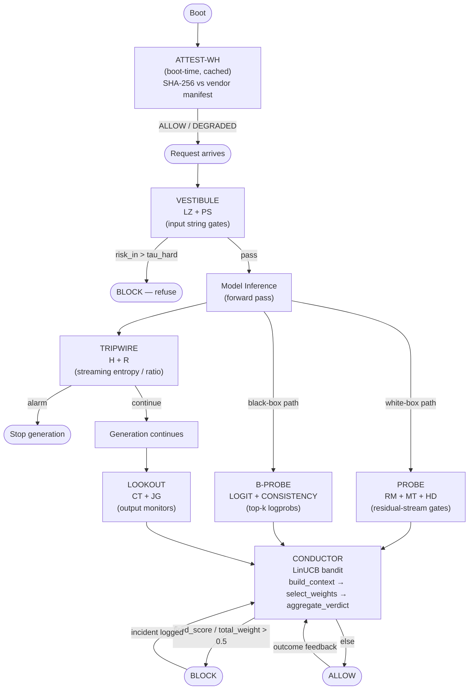
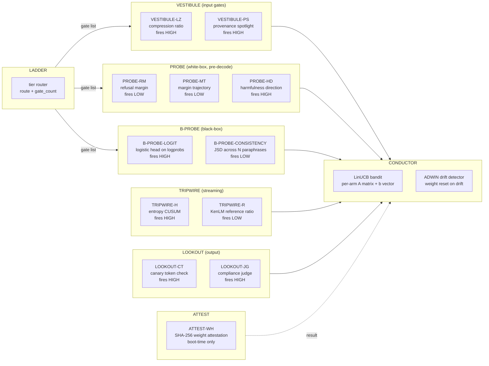
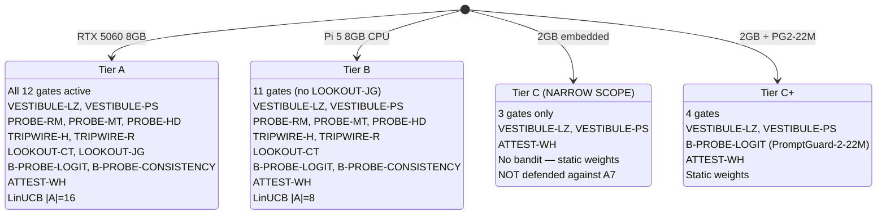
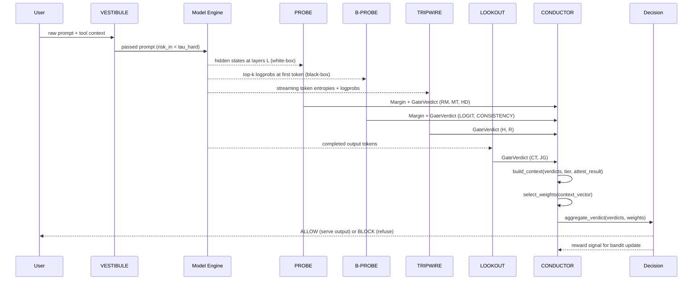

[← README](../README.md) &nbsp;|&nbsp;
[What is it](what_is_it.md) &nbsp;|&nbsp;
[Architecture](architecture.md) &nbsp;|&nbsp;
[Math](math.md) &nbsp;|&nbsp;
[Setup](setup.md) &nbsp;|&nbsp;
[Engineering Ref](engineering_reference.md)

# System Architecture

## 1. Request Cycle

> The request cycle is stateless per-request. ATTEST-WH runs once
> at boot and its result is cached. All other gates run on every
> request in the order shown. The CONDUCTOR aggregates all verdicts
> into a single block/allow decision.

## 2. Eight Components

> Firing directions are shown inline (fires HIGH or fires LOW).
> Gates in the left column (VESTIBULE, PROBE, LOOKOUT) run before
> and after generation. Gates in the right column (TRIPWIRE) run
> during generation.

## 3. Tier Gate Selection

## 4. CONDUCTOR Feature Vector

> The 14-dimensional context vector is assembled by
> `conductor/context.py`. Missing gates (not active for the tier)
> are filled with 0.0. The tier indicator at index 13 is always
> present regardless of tier.

The CONDUCTOR context vector has 14 dimensions. All values are floats in [0, 1] or [-1, 1]. Missing gates (not active for the tier) are filled with 0.0.

| Index | Feature | Source Gate | Notes |
|---|---|---|---|
| 0 | VESTIBULE-LZ score | VESTIBULE-LZ | Compression ratio (higher = more compressible = less suspicious) |
| 1 | VESTIBULE-PS score | VESTIBULE-PS | Signal score (higher = more provenance signals detected) |
| 2 | PROBE-RM margin | PROBE-RM | Refusal-direction cosine (lower = further from refusal subspace = risk) |
| 3 | PROBE-MT rho_dot | PROBE-MT | First derivative of margin trajectory (negative = margin falling) |
| 4 | PROBE-MT rho_ddot | PROBE-MT | Second derivative — computed in MT, deferred to context builder |
| 5 | PROBE-HD margin | PROBE-HD | Harmfulness-direction cosine at user-instruction token |
| 6 | TRIPWIRE-H CUSUM | TRIPWIRE-H | Final CUSUM statistic (higher = more cumulative entropy deviation) |
| 7 | TRIPWIRE-R LLR | TRIPWIRE-R | Log-likelihood ratio vs benign reference (lower = more adversarial) |
| 8 | LOOKOUT-CT count | LOOKOUT-CT | Number of canary tokens found in output (normally 0) |
| 9 | LOOKOUT-JG rate | LOOKOUT-JG | Compliance rate across N paraphrases (higher = suspicious) |
| 10 | B-PROBE-LOGIT score | B-PROBE-LOGIT | Logistic head output on top-k logprobs |
| 11 | B-PROBE-CONSISTENCY JSD | B-PROBE-CONSISTENCY | Jensen-Shannon divergence across N paraphrases |
| — | *Metadata dimensions* | — | — |
| 12 | ATTEST-WH result | ATTEST-WH | 1.0=ALLOW, 0.5=DEGRADED, 0.0=BLOCK |
| 13 | Tier indicator | LADDER | 0.0=A, 0.33=B, 0.67=C, 1.0=C_PLUS |

## 5. Component Interaction (Sequence)

> The sequence shows the white-box path (PROBE gets hidden states).
> On the black-box path, PROBE is skipped and B-PROBE receives
> top-k logprobs instead. TRIPWIRE runs concurrently with generation
> via a streaming callback.

---

[← Back to README](../README.md) &nbsp;·&nbsp;
[Open an issue](https://github.com/YOUR_USERNAME/CLIFFGUARD/issues) &nbsp;·&nbsp;
[preregistration.md](preregistration.md)

