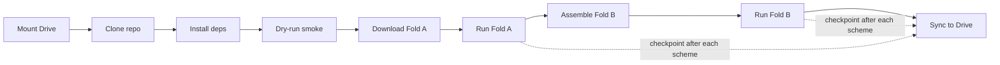

<div align="center">

[← setup_3050](setup_3050.md) &nbsp;|&nbsp;
**setup_colab** &nbsp;|&nbsp;
[up to setup ↑](setup.md)

</div>

# CLIFFGUARD on Google Colab


## Quick Reference

| Tier | Free T4 (16 GB) | Pro A100 (40 GB) | Pro+ A100 (80 GB) |
|---|---|---|---|
| Model size | Llama-3.2-3B FP16 / 8B NF4 | Llama-3.1-8B FP16 / 13B NF4 | 13B FP16 / 70B NF4 |
| Real judges? | Llama-Guard NF4 only | Yes | Yes |
| Background exec | No | No | Yes |
| Session length | ~12 h, pre-empted | Longer | Longest, priority |

---

## 1. TL;DR

CLIFFGUARD runs end-to-end on a Colab GPU with no local hardware. **Which
notebook you want depends on what you are asking**, and all of them checkpoint
to Google Drive so a disconnected runtime loses at most one scheme of compute:

| Notebook | Use it for | Runtime |
|---|---|---|
| [`colab_run.ipynb`](../notebooks/colab_run.ipynb) | Reproducing the paper: 7B judge, Qwen2.5-3B and Phi-3.5-mini, refusal + GSM8K arms | T4, 60–90 min reduced / ~2.5 h full |
| [`colab_round2.ipynb`](../notebooks/colab_round2.ipynb) | The round-2 gaps: 256-token budget, AWQ/GPTQ/NF4, 1.5B regrade | T4, ~4 h |
| [`colab_labelled.ipynb`](../notebooks/colab_labelled.ipynb) | Both annotation axes on the labelled suites, and the 2×2 | T4, several sessions; resumes |

Sections 7 and 8 below describe the first two, which share a checkpoint helper.
`colab_labelled.ipynb` uses a journal instead and needs no manual steps at all —
see §8.

**You'll get:**
- Paired transition counts against each model's own FP16 baseline, with the
  degeneracy rate reported beside every refusal rate.
- The phrase-list estimate on identical completions under four marker lists and
  both gates, which is what separates the grader effect from the gate effect.
- A persistent run directory in `/content/drive/MyDrive/cliffguard/`.

> `cliffguard_colab.ipynb` and `colab_helper.py` belong to an earlier design and
> are kept for provenance only. Its labels come from a corpus partition that
> agrees with model behaviour 52.4% of the time — chance. Do not start there.

## 2. Why Colab

Use Colab when you don't have a local CUDA GPU, when your local GPU has
less than 8 GB of VRAM, or when you need to measure a model your local
card cannot hold. A Colab Pro A100 (40 GB) beats a local RTX 3050 8 GB
on every CLIFFGUARD workload that needs more than 6 GB of working VRAM —
specifically anything involving Llama-3.1-8B-Instruct in FP16, the
Llama-Guard-3-8B judge in FP16, or GGUF Q3_K_M weights for 13B+ models.

For 1B–3B work, a local 3050 with `uv sync --extra gpu` is faster
end-to-end because there is no Drive round-trip. Use the
[`setup_3050.md`](setup_3050.md) path in that case.

## 3. Hardware availability on Colab

Colab allocations change weekly; the values below describe the typical
shape of what each tier delivers.

- **Free.** T4 16 GB. Session length ~12 h with frequent pre-emption.
  No background execution.
- **Pro.** Priority access to T4, L4, or A100 40 GB depending on what
  Google has spare. Longer sessions and higher idle tolerance, still
  foreground-only.
- **Pro+.** A100 40 GB or 80 GB with priority allocation. Background
  execution (the notebook keeps running after you close the tab) is
  available — this is the only way to do an unattended multi-hour run
  on Colab.

Always confirm the actual allocation at the start of a session with
`nvidia-smi` (cell C1 of the notebook). The output line you want is
`NVIDIA <device-name>` followed by the memory line.

## 4. What fits on what

Numbers below assume the model plus KV cache for a 2K context window
plus the residual-stream hooks CLIFFGUARD installs. Memory cost is
estimated as ~2 GB per 1B params in FP16 and ~0.5 GB per 1B in NF4 —
see blueprint §10 for the hardware envelopes the project targets.

| Hardware | Max FP16 model | Max NF4 model | Max GGUF Q3_K_M | Llama-Guard-3-8B judge |
|---|---|---|---|---|
| T4 16 GB | 3B | 13B | 30B | NF4 only (FP16 OOMs) |
| L4 24 GB | 8B | 30B | 70B | Yes (NF4) |
| A100 40 GB | 13B | 70B | 70B | Yes (FP16 or NF4) |
| A100 80 GB | 30B | 70B (FP16) | 70B (FP16) | Yes (FP16) |

The defaults in [`notebooks/colab_helper.py`](../notebooks/colab_helper.py)
`choose_model()` stay one model-class below the hardware ceiling to
leave headroom for activations and the residual-stream collection
buffer that Fold A allocates per layer.

## 5. The Colab workflow at a glance



Drive is the persistence layer; the local `/content/CLIFFGUARD/`
directory is ephemeral and gets recreated on every reconnect.

## 6. Wall-clock estimates

Estimates only — vary with HF download speed, dataset cache state, and
whether you are sharing the GPU.

| Step | T4 (free) | A100 (Pro) |
|---|---|---|
| Install + setup | 8–12 min | 5–8 min |
| Fold A download (HH + OASST, `--max 500`) | 5–8 min | 5–8 min |
| Fold A on 3B, FP16 + NF4 | 25–35 min | 8–12 min |
| Fold B assembly (AdvBench + JBB) | 1–2 min | 1–2 min |
| Fold B on 100 prompts × 2 schemes | 15–20 min | 5–8 min |
| Drive sync (~150 MB run dir) | 30–60 s | 30–60 s |

## 7. Step-by-step workflow

Open [`notebooks/cliffguard_colab.ipynb`](../notebooks/cliffguard_colab.ipynb)
in Colab. The cell map:

| Cell | Type | What it does |
|---|---|---|
| M0 | md | Title, TL;DR, disconnect warning |
| C1 | code | `nvidia-smi` + `torch.cuda.mem_get_info` |
| M2 | md | T4 / L4 / A100 expectations |
| C3 | code | Mount Drive, create `cliffguard/` staging tree |
| M4 | md | Drive layout |
| C5 | code | Clone the repo (edit `<owner>` first) |
| C6 | code | `uv venv` + extras install |
| M6 | md | Plain-pip fallback if `uv` activation flakes |
| C7 | code | `llama-cpp-python` rebuild with CUDA |
| M8 | md | HuggingFace login intro |
| C9 | code | `huggingface_hub.login()` interactive |
| C10 | code | Import `colab_helper`, print banner |
| M11 | md | Smoke-test intro |
| C12 | code | `scripts/dry_run.py --tier A --scheme FP16` + Tier C |
| M13 | md | Dataset-download intro |
| C14 | code | `symlink_datasets_from_drive` + `download_fold_a.py --download --max 500` |
| M15 | md | `choose_model` table |
| C16 | code | `config = ch.choose_model()` |
| M17 | md | Fold A overview |
| C18 | code | `ch.run_fold_a_with_checkpoint(config)` |
| M19 | md | Sync intro |
| C20 | code | `ch.sync_artifacts_to_drive()` |
| M21 | md | Fold B assembly intro |
| C22 | code | `ch.assemble_fold_b()` |
| M23 | md | Fold B overview |
| C24 | code | `ch.run_fold_b_with_checkpoint(config)` + sync |
| M25 | md | Wrap-up, resume instructions |

Each `(model, scheme)` write triggers a Drive sync, so you can stop at
any cell boundary without losing work.

## 8. Resuming a dead session

Colab disconnects can happen mid-cell. The runtime, the cloned repo,
and the venv are all gone after a disconnect, but
`/content/drive/MyDrive/cliffguard/` is intact.

1. Reconnect to a runtime (*Runtime → Connect*).
2. Re-run cells **C1 through C10** in order — they restore the runtime
   shape: GPU check, Drive mount, repo clone, dependency install, HF
   login, helper import.
3. Re-run **C18** (`run_fold_a_with_checkpoint`). The helper reads
   `fold_a/checkpoint.json` from your existing run directory, sees
   which `completed_schemes` are listed, and skips them. It picks up
   from the first scheme in `pending_schemes`.
4. Re-run **C24** for Fold B. Same checkpoint mechanism in
   `fold_b/checkpoint.json`.

You lose **at most one scheme** of compute — the scheme that was
running when the runtime died. Everything else is restored from Drive.

### `colab_labelled.ipynb` resumes differently, and needs no steps

That notebook does not use the checkpoint helper above. Every stage is a step in
a journal on Drive (`scripts/colab_pipeline.py`), so recovery is one action:

> **Reconnect and re-run the pipeline cell.** That is the whole procedure.

It skips steps that finished, re-runs steps whose command, declared output or
environment changed, re-runs steps whose output has gone missing, and resumes
part-finished steps from their per-scheme caches. Two behaviours are worth
knowing about because they look like failures and are not:

- **A step that never started.** Near the end of a session the pipeline refuses
  to *begin* a step it estimates will not fit, marks it `pending`, and stops. It
  is stopping cleanly between steps instead of being killed inside one. Set
  `DEADLINE_HOURS` slightly under your session limit — 3.5 for free, 11 for Pro.
- **A step that says `killed` and retries.** Return code −9 is the host OOM
  killer, not a bug. Each attempt starts from the caches the previous one wrote,
  so a retry makes progress rather than repeating. It gives up after two.

Its run directories go to Drive through `CLIFFGUARD_ARTIFACTS`, so nothing that
matters is written to `/content` and there is no copy-back step to forget.
Per-step logs are on Drive too, under `logs_labelled/` — worth knowing, because a
closed browser tab loses Colab's cell output entirely and the log is then the
only record of why something failed.

## 9. Where results live

There are three storage layers, each with a different lifetime:

- **Ephemeral.** `/content/CLIFFGUARD/artifacts/` on the Colab VM.
  Gone on disconnect — never trust it as the only copy.
- **Drive persistent.** `/content/drive/MyDrive/cliffguard/results/<run_id>/`.
  Survives reconnect. This is the source of truth during the run.
- **Git branch (optional).** If you want a run permanently captured in
  git history, create a branch `results-<run_id>` and commit the
  selected artifacts (the JSON files; never the `.npz` direction
  vectors — they're large and binary).

## 10. What's stored per run

Every run directory has the same shape, regardless of which fold you
ran:

```
artifacts/runs/<run_id>/
├── run_metadata.json          ← run_id, git SHA, host, timestamps,
│                                 model_id, schemes, layer, fpr_target
├── fold_a/
│   ├── calibration_summary.json   ← τ_q thresholds per scheme
│   ├── r_hat_<model>_<scheme>.npz ← refusal direction unit vector
│   └── checkpoint.json            ← resumption state for Fold A
├── fold_b/
│   ├── cliff_results.json         ← Δ_cliff, Δ_W-cliff, Δ_B-cliff
│   │                                  per scheme + H1 verdict
│   └── checkpoint.json            ← resumption state for Fold B
└── manifest.json              ← SHA-256 of every artifact;
                                  produced by
                                  scripts/build_preregistration_manifest.py
```

`run_metadata.json` is written immediately when the run starts so even
a partial run is identifiable by its `run_id`. `manifest.json` is
written at the end and is the file you cite in any paper or report.

## 11. HuggingFace gating

These models are gated. You must accept the license on each model's
HuggingFace page **once** under the same account whose token you paste
into the notebook:

| Model | Used for | License page |
|---|---|---|
| `meta-llama/Llama-3.2-1B-Instruct` | Tier C / low-VRAM Fold A | huggingface.co/meta-llama/Llama-3.2-1B-Instruct |
| `meta-llama/Llama-3.2-3B-Instruct` | Default Tier A Fold A on T4 | huggingface.co/meta-llama/Llama-3.2-3B-Instruct |
| `meta-llama/Llama-Guard-3-8B` | LOOKOUT-JG real judge | huggingface.co/meta-llama/Llama-Guard-3-8B |
| `mistralai/Mistral-7B-Instruct-v0.3` | Alternative rubric grader | huggingface.co/mistralai/Mistral-7B-Instruct-v0.3 |

The notebook's cell C9 (`from huggingface_hub import login; login()`)
prompts you to paste a token. Generate a **read** token at
[huggingface.co/settings/tokens](https://huggingface.co/settings/tokens).
The token is cached for the session but not persisted across
disconnects — paste it again after a reconnect.

## 12. What you cannot do on free Colab

Be honest about what doesn't fit:

| Limitation | Workaround |
|---|---|
| Llama-3.1-8B FP16 baseline (~16 GB) | Use NF4 (~4 GB), or upgrade to Pro for A100 access |
| Llama-Guard-3-8B at FP16 | Use NF4 quantization (the `RealLlamaGuardJudge` default) |
| 24-hour unattended runs | Pro+ background execution; otherwise chunk into ≤ 8 h foreground sessions |
| Full 3-family × 5-scheme replication in one session | Run one family per session, checkpoint to Drive between sessions |
| The full Fold B corpus on 500+ prompts at multiple schemes | Use `--max-prompts` to subsample; pre-registration accepts a subsampled run as long as the seed is recorded |

## 13. Troubleshooting

**`CUDA out of memory` during Fold A.**
The chosen model is too large for the allocated GPU. Edit the cell
after `ch.choose_model()` and either drop `FP16` from `config['schemes']`
(keep `NF4` only) or change `config['model_id']` to a smaller model
from the table in §4. Then re-run cell C18 — the checkpoint will
preserve any completed schemes.

**Session disconnects right after `uv pip install`.**
The `uv` activation pattern (`!. .venv-colab/bin/activate && ...`)
relies on `PATH` inheritance into the `!` subshell, which some Colab
runtimes don't preserve. Switch to the plain-pip fallback shown in
cell M6 — it installs into Colab's system Python instead of an
isolated venv. The trade-off is that you pollute the runtime's
system packages; on Colab that doesn't matter because the runtime is
destroyed at the end of the session anyway.

**HuggingFace download stalls or returns `Repo gated`.**
Two causes. Either your token does not have read access (regenerate
at huggingface.co/settings/tokens), or you have not accepted the
model's license on its HF page under the same account. Visit each
gated-model page in §11 from the same browser, click *Agree and
access repository*, then rerun cell C9 with a fresh token.

**`llama-cpp-python` reports "no CUDA support" at runtime.**
The `CMAKE_ARGS="-DLLAMA_CUDA=on"` env var didn't reach the build.
Re-run cell C7 explicitly — Colab `!` cells do honour env vars set
inline as `KEY=value command`, but only on the same line. If a copy
of `llama-cpp-python` was installed earlier without CUDA, force a
clean rebuild: `!pip uninstall -y llama-cpp-python; CMAKE_ARGS="-DLLAMA_CUDA=on" pip install --force-reinstall --no-cache-dir llama-cpp-python`.

**Drive sync is slow during a fold.**
Each `sync_artifacts_to_drive` call copies only changed files, but a
fresh `.npz` direction vector is ~10–50 MB. If you are running many
schemes back-to-back and want to minimise mid-fold latency, comment
out the inner sync calls in `colab_helper.run_fold_a_with_checkpoint`
and call `ch.sync_artifacts_to_drive()` once at the end. The
trade-off is that a disconnect mid-run now costs you the whole fold
instead of just one scheme.

## 14. Cost

The free tier costs nothing. Colab Pro and Pro+ are monthly
subscriptions; prices change, so check
[colab.research.google.com/signup](https://colab.research.google.com/signup)
for the current rates. For most CLIFFGUARD reproduction work, a single
month of Pro is enough — about 20–40 hours of A100 compute, well above
the time budget for a 2-model × 3-scheme replication on Llama-3.1-8B.

---

<div align="center">

[← setup_3050](setup_3050.md) &nbsp;·&nbsp;
[setup](setup.md) &nbsp;·&nbsp;
[notebooks/cliffguard_colab.ipynb](../notebooks/cliffguard_colab.ipynb)

</div>

*Last updated: 2026-05-19; based on `cliffguard-unified-paper.md` at commit 964042b.*
